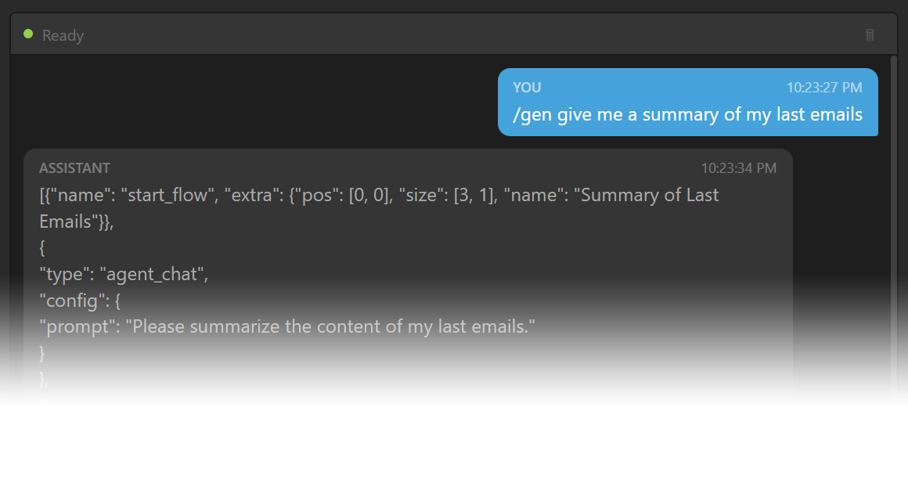
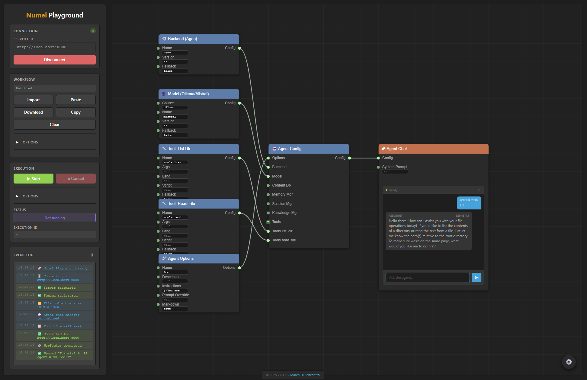
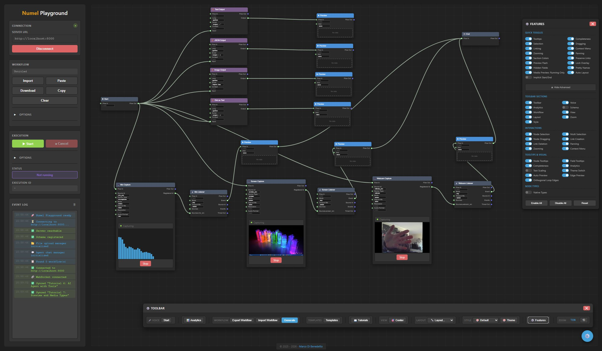

# Numel Playground



**Numel Playground** is a visual editor and runtime for building autonomous AI agent workflows. It combines a node-based graph canvas with a Python backend, enabling you to design, execute, and self-optimize complex AI pipelines — without writing boilerplate code.

> ComfyUI generates images. Numel generates the *best* result — automatically.

[^1]: Currently [Agno](https://www.agno.com) is the supported agent framework.




---

## Key Differentiators

| Feature | Numel | n8n | ComfyUI |
|---------|-------|-----|---------|
| UI generated from schema | Live Python Pydantic | Hardcoded | Hardcoded |
| Workflow generation from text | `/gen` command + Planner | No | No |
| Self-optimizing eval loop | `eval_flow` + Planner | No | No |
| Real-time browser ML | MediaPipe pose/face/hands | No | No |
| Multi-channel deployment | 7 platforms | Limited | No |
| Agent-first architecture | Native nodes | Integration only | N/A |
| Multi-tenant with quotas | Roles, quotas, admin panel | Enterprise only | No |
| Swappable provider backends | Auth, Data, Execution | No | No |

---

## Architecture

```
+-----------------+       WebSocket / REST       +-------------------+
|    Frontend     | <------------------------->  |     Backend       |
|  (Browser)      |                              |  (Python)         |
|                 |                              |                   |
| Canvas Editor   |   POST /schema               | FastAPI Server    |
| Node Palette    | <-- Python source ---------- | Pydantic Schema   |
| Event Log       |                              | Agno Framework    |
| Console Agent   |   WS /events                 | Workflow Engine   |
| Media Overlay   | <-- real-time events ------- | Eval + Planner    |
+-----------------+                              +-------------------+
```

- **Backend**: FastAPI server (`app/`) with Pydantic models defining every node type. The raw Python schema source is sent to the frontend, which parses it to build the node palette dynamically — no build step.
- **Frontend**: Vanilla JavaScript canvas-based graph editor (`web/schemagraph/`). Pre-bundled assets for CodeMirror, Three.js, and AGUI client.
- **Communication**: REST for commands, WebSocket for real-time events (execution progress, streaming, media overlay).

---

## Getting Started

### Prerequisites

- Python 3.12+
- `pip install -r requirements.txt`
- For AI agents: [Ollama](https://ollama.com) running locally, or API keys for OpenAI / Anthropic / Groq / Google
- A modern web browser (Chrome, Firefox, Edge)

### Starting the Server

```bash
cd app
python app.py
```

The server starts on port **11360** by default.

Optional flags:
- `--tunnel` — Start a Cloudflared/ngrok tunnel for public webhook access

### Connecting the Frontend

1. Open `web/index.html` in your browser (serve via any static file server, or open directly)
2. Enter the server URL (default: `http://localhost:11360`)
3. Click **Connect** — the status indicator turns green

---

## Features at a Glance

### Visual Workflow Editor
- **71+ node types** across configuration, data flow, control flow, events, AI/ML, and interactive categories
- **Pan, zoom, select, connect** — full graph editing with undo/redo
- **Inline field editing** with type-aware inputs (text, number, code, dropdown)
- **Code editor modal** for Python/Jinja2 script fields
- **Node search** (Ctrl+F) with instant filtering
- **Mini-map** for large workflow navigation
- **Multi-tab** support for parallel workflows
- **6 drawing styles**: Default, Minimal, Blueprint, Neon, Organic, Wireframe
- **3 themes**: Dark, Light, Ocean
- **Selection rectangle**, copy/paste, snap-to-grid

### AI Agent System
- **5 LLM providers**: Ollama, OpenAI, Anthropic, Groq, Google
- **Agent configuration nodes**: Backend, Model, Options, Tools, Toolkits, Memory, Session, Knowledge — all wired visually
- **Agent Chat** node with streaming responses, message history, and file preview
- **Agent Flow** node for non-interactive agent execution within workflows
- **RAG pipeline**: Content DB + Vector DB + Knowledge Manager for document-grounded agents
- **14 built-in toolkits** (see below)
- **Dynamic toolkit creation**: Agents can write their own Python toolkits at runtime

### Autonomous Planner
- **Planner mode** in the assistant console — describe what you want, the agent builds it
- **Eval-driven refinement**: `eval_flow` nodes score outputs, planner reads scores and iterates
- **Two profiles**:
  - **Workflow Builder** — designs, runs, and refines workflows using eval scores
  - **Image Prompt Optimizer** — generates, evaluates, and refines prompts using CLIP + aesthetic scoring
- **Configurable timeout**, max turns, and interrupt button
- **Auto-applies** generated workflow JSON to the canvas in real-time

### Real-Time Media & ML
- **Browser Source** node captures webcam, microphone, or screen
- **MediaPipe inference** (pose, face, hands) runs client-side with zero latency
- **Stream Display** renders landmarks/overlays on the canvas
- **Backend CV** for server-side inference (chainable with other nodes)
- **Dual inference modes**: Frontend (fast, non-blocking) or Backend (composable)

### Image Generation Integration
- **ComfyUI Toolkit** — full REST API wrapper (19 tools: generate, queue, history, models, upload)
- **Diffusers Toolkit** — native HuggingFace diffusers (no external server needed)
- **Image Eval Toolkit** — CLIP prompt alignment + LAION aesthetic scoring
- **Agent-guided generation**: describe what you want → agent writes prompt → generates → scores → refines

### Event-Driven Workflows
- **Timer Source** — periodic triggers with configurable interval
- **File System Watch** — monitors directories for changes
- **Webhook Source** — creates HTTP endpoints that trigger events
- **Browser Source** — media capture events
- **Event Listener** — waits for events with modes: `any`, `all`, `race`
- Persistent reactive workflows that run indefinitely

### Multi-Channel Deployment
Deploy agents to 7 messaging platforms:

| Channel | Adapter |
|---------|---------|
| Telegram | TelegramAdapter |
| WhatsApp | WhatsAppAdapter |
| Discord | DiscordAdapter |
| Slack | SlackAdapter |
| Signal | SignalAdapter |
| Microsoft Teams | TeamsAdapter |
| Custom Webhook | WebhookChannelAdapter |

All channels support auto-start, persistence, and unified message routing to the console agent.

### Published Apps
- Export any workflow as a **standalone web endpoint** with auto-generated UI
- Access via `/published-apps/run/{slug}`
- Share workflows as deployable services

### Assistant Console
- **AI chat panel** with streaming (AGUI) and REST fallback
- **Model selection** dropdown (switch LLMs on the fly)
- **Toolkit picker** — enable/disable toolkits per session
- **Voice features**: Text-to-speech (with voice/language selection), speech-to-text (microphone input)
- **Persistent memory** across sessions (SQLite-backed)
- **Proactive suggestions** via WebSocket
- **`/gen` command** — generate workflows from natural language

### User Management & Admin
- **Multi-user auth** with registration, login, and guest access
- **Role-based access control** (Admin / User / Viewer)
- **Per-user resource quotas** (CPU, storage, GPU, concurrent runs)
- **User panel** — profile info, quota usage bars, and password change
- **Admin panel** — slide-out UI with user management, execution monitoring, and system stats
- **System toolkit** — AI assistant can manage users, quotas, and executions via natural language
- **User-scoped data** — execution history filtered by user (admins see all)
- **Provider abstraction** — swappable auth, data, and execution backends via `server_config.json`

---

## Node Types (71+)

### Endpoints
| Node | Description |
|------|-------------|
| **Start** | Workflow entry point. Outputs workflow variables. |
| **End** | Workflow exit point. |
| **Sink** | Dead end — terminates a branch. |

### Data Flow
| Node | Description |
|------|-------------|
| **Preview** | Displays data (auto-detects text, JSON, images, audio, video, 3D). |
| **Transform** | Python/Jinja2 data transformation. Sets `output` in script. |
| **Route** | Conditional branching by target value. |
| **Combine** | Merges named inputs into one output dict. |
| **Merge** | First non-null selector. |
| **Map/Extract** | Extract nested values by dot-path key. |
| **Accumulate** | Collect values across iterations. |

### Control Flow
| Node | Description |
|------|-------------|
| **If/Else** | Conditional with `true_out` / `false_out`. |
| **Loop Start/End** | While-style loop with condition and max iterations. |
| **ForEach Start/End** | Iterate over a list (outputs `current`, `index`). |
| **Break / Continue** | Loop control. |
| **Gate** | Threshold accumulator — fires when condition met. |
| **Delay** | Pause execution for N milliseconds. |
| **Retry** | Automatic retry with backoff. |

### Evaluation
| Node | Description |
|------|-------------|
| **Eval** | Score outputs with Python. Sets `score` (0-1) and `feedback`. |
| **Notify** | Send notifications/log messages. |

### Agent Configuration
| Node | Description |
|------|-------------|
| **Backend** | Framework selection (Agno). |
| **Model** | LLM provider + model name. |
| **Agent Options** | Name, instructions, system prompt. |
| **Agent Config** | Master node wiring all config together. |
| **Tool / Toolkit** | Tool or toolkit module reference. |
| **Embedding** | Embedding model for RAG. |
| **Content DB / Vector DB** | Storage for RAG pipeline. |
| **Memory / Session / Knowledge Manager** | Agent memory subsystems. |

### Execution
| Node | Description |
|------|-------------|
| **Agent Flow** | Run one agent turn (request → response). |
| **Agent Chat** | Interactive chat with streaming UI. |
| **Tool Flow** | Execute a tool or toolkit method. |
| **HTTP Request** | HTTP client (GET, POST, PUT, DELETE). |
| **User Input** | Pause and prompt the user for text. |
| **Tool Call** | Interactive tool with Execute button. |

### Event Sources
| Node | Description |
|------|-------------|
| **Timer Source** | Periodic event emitter. |
| **FS Watch Source** | File system change monitor. |
| **Webhook Source** | HTTP endpoint creator. |
| **Browser Source** | Webcam / microphone / screen capture. |
| **Event Listener** | Wait for events (any/all/race mode). |

### ML / Vision
| Node | Description |
|------|-------------|
| **Pose Detector** | MediaPipe pose detection. |
| **Computer Vision** | Backend CV (pose/face/hands). |
| **Stream Display** | Render overlays on browser video. |

### Native Types
Direct value nodes: **String**, **Integer**, **Real**, **Boolean**, **List**, **Dictionary**.

### Data
| Node | Description |
|------|-------------|
| **Source Meta** | Metadata holder (MIME type, format, size, duration, etc.). |
| **Data Tensor** | Tensor data (dtype, shape, nested arrays). |

---

## Built-in Toolkits (14)

| Toolkit | Key Methods | Description |
|---------|-------------|-------------|
| **file_toolkit** | list_directory, read_file, write_file, search_files | Filesystem operations |
| **http_toolkit** | get, post, put, delete, request | HTTP client with auth |
| **database_toolkit** | query, execute, insert, list_tables, describe_table | SQL databases (any SQLAlchemy URL) |
| **email_toolkit** | send, fetch, mark_read, list_folders | SMTP + IMAP email |
| **search_toolkit** | search, news | Web search (DuckDuckGo, Tavily) |
| **slack_toolkit** | send_message, list_channels, get_messages | Slack API integration |
| **code_toolkit** | create_toolkit, read_toolkit, list_toolkits | Dynamic Python toolkit creation |
| **console_toolkit** | get_workflow_summary, validate_workflow | Workspace inspection (read-only) |
| **workspace_toolkit** | add_node, connect, run, get_eval_scores | Workspace editing (planner mode) |
| **comfyui_toolkit** | generate, generate_simple, upload_image, list_models | ComfyUI server integration (19 tools) |
| **diffusers_toolkit** | generate, img2img, list_models, change_model | Native HuggingFace image generation |
| **image_eval_toolkit** | clip_score, aesthetic_score, evaluate, compare | Image quality evaluation (CLIP + LAION) |
| **tts_toolkit** | speak, list_voices, save_speech | Text-to-speech |
| **system_toolkit** | list_users, get_system_stats, update_quota, list_executions | System administration (admin only) |

### User-Contributed Toolkits (`contrib/toolkits/`)
- **context_toolkit** — System context awareness (OS, network, clipboard, idle time)
- **mesh_toolkit** — 3D model processing (load, repair, decimate, smooth, remesh)
- **text_stats_toolkit** — Word count, keyword extraction, summarization

Upload custom Python toolkits via the **Upload Toolkit** button in the UI.

---

## User Authentication & Multi-Tenant Support

Numel supports multi-user mode with registration, login, role-based access control, and per-user resource quotas.

### Auth Modes

Configure via `app/server_config.json`:

| Mode | Config | Description |
|------|--------|-------------|
| **None** | `"type": "none"` | Single-user, no login required (default for development) |
| **Local** | `"type": "local"` | File-backed users (`users.json`), HMAC tokens |
| **Django** | `"type": "django"` | Django user management (planned) |

```json
{
  "auth":      { "type": "local", "path": "users.json" },
  "data":      { "type": "local", "root": "storage/repos" },
  "execution": { "type": "local", "api_url": "http://localhost:11360" }
}
```

### Login Flow

When auth is enabled (`"type": "local"`), the frontend shows a login modal at startup with three options:

1. **Sign In** — username and password
2. **Create Account** — register a new user (first user automatically becomes admin)
3. **Continue as Guest** — skip authentication and use the app without an account

After login, a Bearer token is stored in `localStorage` and injected into all API requests. The **User Panel** (click the user icon or username) shows your profile, quota usage with color-coded progress bars, and a password change form.

### Roles & Permissions

| Role | Access |
|------|--------|
| **Admin** | Full access: user management, quota control, all executions, system stats |
| **User** | Standard access: own workflows, own execution history |
| **Viewer** | Read-only access |

Permissions can be granted per resource (e.g., `repo:user/data`, `workflow:my-flow`) with levels: `none`, `read`, `write`, `execute`, `owner`.

### Resource Quotas

Each user has configurable resource limits:

| Quota | Default |
|-------|---------|
| CPU time | 10 hours |
| Storage | 1 GB |
| Concurrent runs | 5 |
| GPU hours | 0 (disabled) |
| Max repos | 50 |

Admins can adjust quotas per user via the Admin Panel or `system_toolkit`.

### Provider Architecture

All backend services are abstracted behind provider interfaces, allowing swappable implementations:

| Provider | Interface | Local Implementation |
|----------|-----------|---------------------|
| **AuthProvider** | `providers/auth.py` | `local_auth.py` (JSON file) |
| **DataProvider** | `providers/data.py` | `local_data.py` (filesystem) |
| **ExecutionProvider** | `providers/execution.py` | `local_exec.py` (in-process) |

Add new implementations (Django, Gitea, Docker) by creating a class that implements the ABC and registering it in `providers_impl/loader.py`.

---

## Admin Panel

The Admin Panel is a slide-out UI accessible to admin users via the **Admin** button in the user bar.

### Users Tab
- List all registered users with role badges and quota summaries
- **Edit** — change email, role (admin/user/viewer)
- **Quota** — adjust CPU, storage, concurrent runs, GPU hours, max repos
- **Deactivate** — soft-delete a user account
- Toggle to show/hide inactive users

### Executions Tab
- View all running executions with real-time status
- Browse execution history with status badges (completed/failed/cancelled)
- Filter by workflow name
- Cancel running executions

### Stats Tab
- Active users / total users
- Running executions / total executions
- Status breakdown (completed, failed, cancelled counts)

### System Toolkit (for AI assistant)

The `system_toolkit` exposes all admin operations as agent tools, so the AI assistant can manage the system via natural language:

```
"List all users and their quotas"
"Give user marco 20 hours of CPU time"
"Show me execution history for the last hour"
"Cancel execution abc123"
```

---

## Credential Store

Store API keys and secrets securely. Reference them in toolkit args with `${CRED_NAME}` syntax:

```json
{"name": "email_toolkit", "args": {"password": "${GMAIL_APP_PASSWORD}"}}
```

Manage via the **Credentials** section in the left panel or via API:
- `GET /credentials` — list names
- `POST /credentials/{name}` — set value
- `DELETE /credentials/{name}` — remove

---

## Workflow JSON Format

```json
{
  "type": "workflow",
  "nodes": [
    {"type": "start_flow", "extra": {"pos": [50, 200], "name": "Start"}},
    {"type": "transform_flow", "lang": "python", "script": "output = 'hello world'", "extra": {"pos": [300, 200], "name": "Transform"}},
    {"type": "eval_flow", "script": "score = 1.0 if 'hello' in str(input) else 0.0", "extra": {"pos": [550, 200], "name": "Eval"}},
    {"type": "end_flow", "extra": {"pos": [800, 200], "name": "End"}}
  ],
  "edges": [
    {"source": 0, "target": 1, "source_slot": "flow_out", "target_slot": "flow_in"},
    {"source": 1, "target": 2, "source_slot": "flow_out", "target_slot": "flow_in"},
    {"source": 2, "target": 3, "source_slot": "flow_out", "target_slot": "flow_in"}
  ]
}
```

- **nodes**: 0-indexed array. `type` matches the Python schema class. `extra` holds visual metadata.
- **edges**: `source`/`target` are node indices. Slot names match schema field names.
- **Multi-input slots** use dot notation: `sources.timer`, `tools.my_tool`, `toolkits.search`
- **Loop-back edges**: include `"loop": true` as a visual hint.

---

## The Canvas

| Action | How |
|--------|-----|
| **Pan** | Click and drag on empty canvas |
| **Zoom** | Mouse wheel |
| **Add node** | Right-click canvas or Ctrl+F to search |
| **Connect** | Drag from output slot (right) to input slot (left) |
| **Select** | Click node; Ctrl+A for all; drag rectangle |
| **Delete** | Select, press Delete or Backspace |
| **Preview data** | Alt+click on an edge to insert a Preview node |
| **Edit fields** | Click a field value to edit inline |
| **Code editor** | Click code icon on script fields |
| **Undo / Redo** | Ctrl+Z / Ctrl+Y |
| **Copy / Paste** | Ctrl+C / Ctrl+V |

---

## Gallery

Pre-built workflow examples accessible from the Gallery panel:

| Category | Examples |
|----------|----------|
| **examples** | Hello workflow, timer-driven agent, webhook handler, list processor |
| **comfyui** | Agent-guided image generation, CLIP-scored refinement loop |
| **planner** | Self-refining agent, email summary, file monitor, research pipeline, webhook responder |
| **webcam** | Pose detection (frontend + backend), audio gate |

Import any gallery item directly into the canvas.

---

## Tutorials

1. [Hello Workflow](docs/tutorial-01-hello-workflow.md) — Start, Preview, End basics
2. [Data Transformation](docs/tutorial-02-transform.md) — Transform data with Python scripts
3. [Routing and Merging](docs/tutorial-03-routing.md) — Conditional branching
4. [Loops and Iteration](docs/tutorial-04-loops.md) — While loops and for-each
5. [Events and Timers](docs/tutorial-05-events.md) — Timer sources and event listeners
6. [AI Agent with Tools](docs/tutorial-06-agent.md) — Full agent setup with chat
7. [Preview and Media](docs/tutorial-07-preview-media.md) — All preview formats
8. [Generating Workflows](docs/tutorial-08-generate.md) — `/gen` command
9. [File Tools](docs/tutorial-09-file-tools.md) — Tool Config + Tool Flow

---

## API Reference

All endpoints use **POST** method unless otherwise noted.

### Core
| Endpoint | Description |
|----------|-------------|
| `/schema` | Get Python schema source |
| `/add` | Add/update workflow |
| `/list` | List workflows |
| `/start` | Execute workflow |
| `/exec_state/{id}` | Execution status |
| `/exec_results/{id}` | Execution results |
| `/exec_cancel/{id}` | Cancel execution |

### Authentication
| Endpoint | Description |
|----------|-------------|
| `/auth/status` | Check if auth is enabled (public) |
| `/auth/register` | Register new user (public) |
| `/auth/login` | Login, returns Bearer token (public) |
| `/auth/logout` | Invalidate token |
| `/auth/me` | Current user info + quota |
| `/auth/change-password` | Change password (requires current password) |

### Admin (requires admin role)
| Endpoint | Description |
|----------|-------------|
| `/admin/users` | List users with quotas |
| `/admin/users/{id}` | Get user detail + permissions |
| `/admin/users/{id}/update` | Update email, role, active status |
| `/admin/users/{id}/delete` | Deactivate user |
| `/admin/users/{id}/quota` | Update quota limits |
| `/admin/users/{id}/permissions` | List user permissions |
| `/admin/users/{id}/permissions/grant` | Grant permission on resource |
| `/admin/users/{id}/permissions/revoke` | Revoke permission |
| `/admin/stats` | System-wide statistics |
| `/admin/executions` | All execution history |
| `/admin/executions/{id}/cancel` | Cancel a running execution |

### Execution History
| Endpoint | Description |
|----------|-------------|
| `/exec-history` | List history (user-scoped, admins see all) |
| `/exec-history/{id}` | Get single execution record |
| `/exec-history/clear` | Clear history |
| `/exec-history/record` | Record new execution (auto-injects user_id) |

### Console Agent
| Endpoint | Description |
|----------|-------------|
| `/console/chat` | Send message (REST or AGUI WebSocket) |
| `/console/planner/enable` | Enable planner mode |
| `/console/planner/disable` | Disable planner |
| `/console/planner/config` | Update planner settings |
| `/console/clear-memory` | Clear agent memory |

### Channels
| Endpoint | Description |
|----------|-------------|
| `/channels/add` | Add channel adapter |
| `/channels/list` | List channels |
| `/channels/{id}/start` | Start channel |
| `/channels/{id}/stop` | Stop channel |

### Gallery & Apps
| Endpoint | Description |
|----------|-------------|
| `/gallery/list` | List gallery items |
| `/gallery/publish` | Publish workflow |
| `/published-apps/publish` | Publish as app |
| `/published-apps/run/{slug}` | Run published app |

### WebSocket Streams
| Endpoint | Events |
|----------|--------|
| `/events` | workflow.started, .completed, .failed, node.*, workspace.changed, eval_scored |
| `/stream/{source_id}` | Real-time media frames and display overlays |
| `/console/proactive` | Agent suggestions and planner messages |

---

## License

See [LICENSE](LICENSE) for details.
