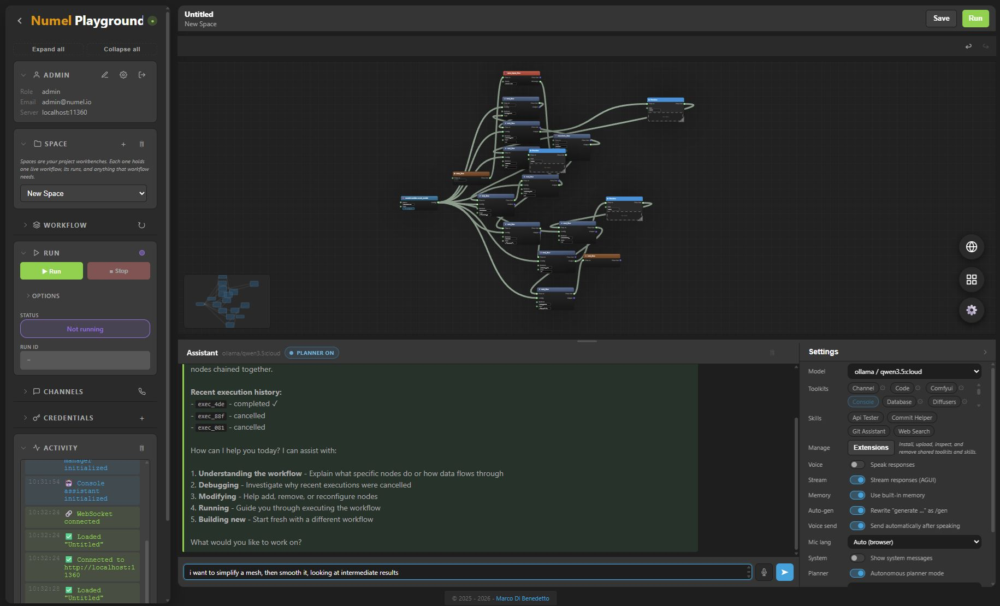

# Numel Playground

For a more approachable introduction aimed at real users rather than a technical feature inventory, see [README_HUMAN.md](README_HUMAN.md).

**Numel Playground** is a visual editor and runtime for building autonomous AI agent workflows. It combines a node-based graph canvas with a Python backend, enabling you to design, execute, and self-optimize complex AI pipelines — without writing boilerplate code.

> ComfyUI generates images. Numel generates the *best* result — automatically.



---

## Key Differentiators

| Feature | Numel | n8n | ComfyUI |
|---------|-------|-----|---------|
| UI generated from schema | Live Python Pydantic | Hardcoded | Hardcoded |
| Workflow generation from text | `/gen` command + Planner | No | No |
| Self-optimizing eval loop | `eval_flow` + Planner | No | No |
| Real-time browser ML | MediaPipe pose/face/hands | No | No |
| Unified multi-channel | 9 platforms + web console | Limited | No |
| Agent-first architecture | Native nodes | Integration only | N/A |
| Per-user isolation | Spaces, credentials, memory, executions — cross-channel | No | No |
| Multi-tenant with quotas | Roles, quotas, admin panel | Enterprise only | No |
| Autonomous agent tasks | Scheduled/event-driven background agents | Workflows only | No |
| Config-selected platform backends | `platform_local` plus `platform_prod` | No | No |

---

## Architecture

```
+-----------------+       WebSocket / REST       +-------------------+
|    Frontend     | <------------------------->  |     Backend       |
|  (Browser)      |                              |  (Python)         |
|                 |                              |                   |
| Canvas Editor   |   POST /schema               | FastAPI Server    |
| Node Palette    | <-- Python source ---------- | Pydantic Schema   |
| Event Log       |                              | Agent Backend     |
| Console Agent   |   WS /events                 | Workflow Engine   |
| Media Overlay   | <-- real-time events ------- | Eval + Planner    |
+-----------------+                              +-------------------+
                                                        |
  +------------+  +----------+  +---------+             |
  |  Telegram  |  |  Discord |  |  Slack  |  ...        |
  +------+-----+  +----+-----+  +----+----+             |
         |             |             |                  |
         +-------------+-------------+------------------+
                       |
              ChannelCommandHandler
              ChannelAgentPool (per-user)
              Backend-managed memory
              (per-user DB paths)
              Platform HTTP layer (spaces, auth, executions)
```

- **Backend**: FastAPI server (`app/`) with Pydantic models defining every node type. The raw Python schema source is sent to the frontend, which parses it to build the node palette dynamically — no build step.
- **Frontend**: Vanilla JavaScript canvas-based graph editor (`web/schemagraph/`). Pre-bundled assets for CodeMirror, Three.js, and AGUI client.
- **Communication**: REST for commands, WebSocket for real-time events (execution progress, streaming, media overlay).

---

## Getting Started

### Prerequisites

- Python 3.12+
- `pip install -r requirements.txt`
- For AI agents: [Ollama](https://ollama.com) running locally, or API keys for OpenAI / Anthropic / Groq / Google
- A modern web browser (Chrome, Firefox, Edge)

### Run Locally Without Docker

This is the simplest way to run Numel's **local/reference slice**.

Recommended path: use the root launcher scripts you prepared.

On Windows PowerShell or Command Prompt:

```powershell
.\run.bat
```

On Linux or macOS:

```bash
bash ./run.sh
```

Those scripts:

- install **uv** if it is missing
- ensure Python **3.12**
- run `uv sync`
- start `app/app.py`

If you want to pass app flags, add them after the script name, for example:

```powershell
.\run.bat --tunnel
```

```bash
bash ./run.sh --tunnel
```

If you prefer to do the same flow manually with **uv**:

```bash
uv python install 3.12
uv sync
uv run python app/app.py
```

Or with a traditional virtualenv:

```bash
python -m venv .venv
. .venv/bin/activate
pip install -r requirements.txt
python app/app.py
```

On Windows PowerShell:

```powershell
python -m venv .venv
.\.venv\Scripts\Activate.ps1
pip install -r requirements.txt
python .\app\app.py
```

Then open:

```text
http://localhost:11360
```

This path uses the public local backend: local identity, `sqlite`, Git-backed
repo-like spaces, local storage under `storage/`, and the normal Numel UI.

### Run Locally With Docker

The root [Dockerfile](Dockerfile) and [docker-compose.yml](docker-compose.yml)
also run the **local/reference slice**, just inside containers.

Build and run the app container directly:

```bash
docker build -t numel-playground .
docker run -p 11360:11360 numel-playground
```

Or use Docker Compose to start Numel plus a local Ollama container:

```bash
docker compose up --build
```

Detached mode:

```bash
docker compose up -d --build
```

Then open:

```text
http://localhost:11360
```

Important distinction:

- root Docker files = **local Numel in containers**
- private `app/platform_prod` slice = **production-oriented backend and deployment path**

So using Docker here does **not** switch Numel to the private `prod` backend.
It only changes how you run the local slice.

### Starting the Server

If you already have the environment prepared and just want the shortest command:

```bash
cd app
python app.py
```

The server starts on port **11360** by default.

Optional flags:
- `--tunnel` — Start a Cloudflared/ngrok tunnel for public webhook access

For the current product-facing design direction, see
[docs/ui-exploration-plan.md](docs/ui-exploration-plan.md) and
[docs/product-roadmap.md](docs/product-roadmap.md).
For the practical first-run starter paths, including repo, mini-app, support,
and ops starters, see
[docs/tutorial-14-first-run-starters.md](docs/tutorial-14-first-run-starters.md).
For the assistant deployment model, including routing, proactive jobs, approvals,
and operator flows, see [docs/assistant-deployments.md](docs/assistant-deployments.md).
For the day-to-day operator surface around deployment inspection, statuses,
network inspection, and snapshot export, see
[docs/assistant-deployment-operations.md](docs/assistant-deployment-operations.md).
For the longer-term assistant network and remote agent architecture, including
Agent Endpoints and A2A fit, see [docs/assistant-network-architecture.md](docs/assistant-network-architecture.md).
For the current convergence model around console, deployments, planner turns,
and live networks becoming workflow-backed surfaces, see
[docs/workflow-backed-surfaces.md](docs/workflow-backed-surfaces.md).
For a concrete implementation-level comparison of the `local` and `prod`
slices, see [docs/local-vs-prod-matrix.md](docs/local-vs-prod-matrix.md).
For a market and positioning comparison against LangChain, n8n, and OpenClaw,
see [docs/competitive-landscape.md](docs/competitive-landscape.md).
Concrete UI concepts for review live in
[`web/prototypes/ui-exploration/`](web/prototypes/ui-exploration/).

### Connecting the Frontend

1. Open `http://localhost:11360`
2. Sign in or create an account
3. Wait for the UI to auto-connect — the status indicator turns green when the backend bootstrap finishes

### Repo-Like Space Model

Numel spaces now behave like lightweight Git-backed project repos.

1. Create or select a **space** in the Workflow panel
2. Browse spaces by scope: **Mine**, **Shared**, and **Public**
3. Open the current workbench for that space, or resolve a public repo directly by `owner/slug`
4. Inspect repo details, switch the active ref for your workbench, browse visible repo assets, and review recent repo commits
5. Edit or run the current workflow asset for the selected space and active ref
6. Save snapshots, review history, compare refs or commits, restore the active branch from a selected repo state, or fork a readable space into your own workbench when you want to adapt it

The default workbench still centers on one current workflow asset for the selected
space, but the space itself is the durable unit: history, refs, forking, and
sharing live at the space/repo level.

The active ref is part of the current workbench context. That means you can
open a repo, switch from `main` to another branch or tag, and the normal
workflow save/load/run/history paths will follow that ref instead of silently
writing back to `main`.

The repo details surface now also works as a lightweight repo browser:

- visible refs and recent commits on the active ref
- visible assets on the active ref, with preview support
- direct opening of workflow assets from the active ref into the workbench
- repo-level compare for refs and commits against the current active repo state
- repo-level restore that writes one new commit onto the active branch when you bring that branch back to a selected historical repo state
- public namespace browsing so `owner/slug` discovery does not depend only on direct lookup

The public side now also has a dedicated **Public Hub** surface:

- namespace pages for browsing all public repos under one owner
- public repo pages for inspecting one repo before opening or forking it
- direct open/fork actions from those public pages
- compare support for public repo refs and commits before you decide to open or fork
- preview support for public repo assets without first switching the current workbench

---

## Features at a Glance

### Visual Workflow Editor
- **70+ node types** across configuration, data flow, control flow, events, AI/ML, and interactive categories
- **Pan, zoom, select, connect** — full graph editing with undo/redo
- **Inline field editing** with type-aware inputs (text, number, code, dropdown)
- **Code editor modal** for Python/Jinja2 script fields
- **Node search** (Ctrl+F) with instant filtering
- **Mini-map** for large workflow navigation
- **Repo-like Git-backed spaces** with a current workflow, snapshot history, and forkable reuse
- **6 drawing styles**: Default, Minimal, Blueprint, Neon, Organic, Wireframe
- **3 themes**: Dark, Light, Ocean
- **Selection rectangle**, copy/paste, snap-to-grid

### AI Agent System
- **5 LLM providers**: Ollama, OpenAI, Anthropic, Groq, Google
- **Agent configuration nodes**: Backend, Model, Options, Tools, Toolkits, Memory, Session, Knowledge — all wired visually
- **Agent Chat** node with streaming responses, message history, and file preview
- **Agent Flow** node for non-interactive agent execution within workflows
- **RAG pipeline**: Content DB + Vector DB + Knowledge Manager for document-grounded agents
- **14 built-in toolkits** (see below)
- **Skills system**: Markdown instruction packages (SKILL.md) that teach agents new abilities without writing Python — wirable as schema nodes in the graph editor
- **Dynamic toolkit creation**: Agents can write their own Python toolkits at runtime

### Autonomous Planner
- **Planner mode** in the assistant console — describe what you want, the agent builds it
- **Per-session planners**: each browser tab and each channel conversation gets its own independent planner — the same user can run multiple planners simultaneously
- **Eval-driven refinement**: `eval_flow` nodes score outputs, planner reads scores and iterates
- **Two profiles**:
  - **Workflow Builder** — designs, runs, and refines workflows using eval scores
  - **Image Prompt Optimizer** — generates, evaluates, and refines prompts using CLIP + aesthetic scoring
- **Configurable** via UI or `/planner` command: timeout, max turns, debounce, profile
- **Auto-applies** generated workflow JSON to the canvas in real-time
- **Workflow lock** ensures exclusive access when multiple planners modify the shared workflow

### Real-Time Media & ML
- **Browser Source** node captures webcam, microphone, or screen
- **MediaPipe inference** (pose, face, hands) runs client-side with zero latency
- **Stream Display** renders landmarks/overlays on the canvas
- **Backend CV** for server-side inference (chainable with other nodes)
- **Dual inference modes**: Frontend (fast, non-blocking) or Backend (composable)

### Image Generation Integration
- **ComfyUI Toolkit** — full REST API wrapper (19 tools: generate, queue, history, models, upload)
- **Diffusers Toolkit** — native HuggingFace diffusers (no external server needed)
- **Image Eval Toolkit** — CLIP prompt alignment + LAION aesthetic scoring
- **Agent-guided generation**: describe what you want → agent writes prompt → generates → scores → refines

### Event-Driven Workflows
- **Timer Source** — periodic triggers with configurable interval
- **File System Watch** — monitors directories for changes
- **Webhook Source** — creates HTTP endpoints that trigger events
- **Browser Source** — media capture events
- **Event Listener** — waits for events with modes: `any`, `all`, `race`
- Persistent reactive workflows that run indefinitely

### Multi-Channel Deployment
Deploy agents to 9 platforms — including the web console itself:

| Channel | Adapter | Media Support |
|---------|---------|---------------|
| Web Console | WebChannelAdapter | Text |
| Telegram | TelegramAdapter | Photos, documents, audio, video, voice, stickers |
| WhatsApp | WhatsAppAdapter | Images, video, audio, documents, stickers |
| Discord | DiscordAdapter | File attachments (any type) |
| Slack | SlackAdapter | File uploads (any type) |
| Signal | SignalAdapter | Attachments via signal-cli |
| Microsoft Teams | TeamsAdapter | Bot Framework attachments |
| Email | EmailAdapter | MIME attachments (any type) |
| Custom Webhook | WebhookChannelAdapter | JSON attachment payloads |

The web assistant console is treated as just another channel — the same code path handles command processing, memory isolation, and agent pooling for all entry points. External channels support auto-start and persistence.

- **End-to-end media & attachments** — all adapters can send and receive files, images, audio, video, and documents. Incoming attachments are normalized into `Attachment` objects (url, mime_type, filename, size) on `ChannelMessage` and flow through the entire pipeline: the agent receives a textual description of each attachment (filename, type, size, URL) injected into the prompt, workflow event sources include attachment metadata in emitted events, and the **Channel Send** node, `/channels/send` API, and `channel_toolkit.send_message()` all accept an `attachments` list that gets dispatched via each platform's native media API (Telegram `send_photo`/`send_document`, Discord file upload, Slack `files.uploadV2`, WhatsApp media messages, Signal base64, Teams Bot Framework, Email MIME parts, Webhook JSON payloads)
- **Cross-channel messaging** — agents can send messages to users on any running channel via the `channel_toolkit` (list channels, send to specific user, broadcast) or the **Channel Send** workflow node
- **Channel-to-channel workflows** — **Channel Receive** event source + **Channel Send** node enable workflows that bridge channels: e.g. translate Telegram messages and forward to Discord, or archive all channel messages to email
- **Per-session auth tokens** — each agent session carries its own auth token, forwarded to toolkits like `workspace_toolkit` so that API calls respect the originating user's permissions
- **Channel ownership** — only the channel creator (or admins) can start, stop, or edit a channel; unauthenticated callers cannot create channels

#### Channel Commands

All channels (including the web console) support `/` commands:

| Command | Description |
|---------|-------------|
| `/help` | Show available commands |
| `/register <user> <email> <pass>` | Create a Numel account |
| `/login <user> <pass>` | Link to existing account |
| `/logout` | Unlink account |
| `/me` | Show profile, role, email, enabled toolkits |
| `/password <current> <new>` | Change password |
| `/toolkits` | List available toolkits with on/off status |
| `/toolkit enable\|disable <name>` | Toggle a toolkit |
| `/planner on\|off\|status [opts]` | Manage autonomous planner |

Planner options (space-separated `key=value`): `profile=workflow`, `max_iter=10`, `timeout=120`, `session_timeout=600`.

Web console users authenticated via the login modal are auto-linked — no explicit `/login` needed.

### Assistant Deployments
- Create named AI services with their own model, instructions, toolkits, skills, channels, and linked workbench
- Route from a front-door deployment to specialist deployments, with conversation-level handoff that stays with the specialist until another handoff happens
- Choose handoff selector policies: `keyword`, `hybrid`, or fully `workflow`, with `hybrid` semantic handoff selection now the default
- Add proactive jobs that run on a schedule or from event-driven triggers such as webhook, channel, file watch, and browser sources
- Require approval before proactive delivery and/or before tool execution
- Operate everything from the Assistant Deployments panel with activity, failures, pending approvals, and linked-workbench navigation
- Export the live deployment network into the workbench with `Open Live Network In Workbench` and apply edited network graphs back into runtime with `Apply Workbench To Network`
- Let less technical users operate a prepared deployment from one panel, while more technical users keep refining the underlying workbench

### Published Apps
- Publish any workflow as a **user-owned standalone web app**
- Access via `/apps/{owner_username}/{slug}` — anyone with the URL can run it
- The published page bundle is **generated at publish time** from the workflow analysis, using the selected model and generation settings
- Generated app files are stored under the owner’s runtime storage, alongside the published app registry
- Publish current work directly from the editor, or publish a gallery item by loading it into a space first
- Public apps can start workflows, poll execution state, cancel runs, and handle inline `user_input_flow` prompts

### Assistant Console
- **AI chat panel** with streaming (AGUI) and REST fallback
- **Unified channel architecture** — the web console is treated as a channel, sharing the same command handler, agent pool, and memory isolation as Telegram/Discord/etc.
- **`/` commands** — `/help`, `/me`, `/toolkits`, `/toolkit`, `/planner`, `/password` all work in the web console
- **Workflow-backed planner turns** — planner turns now execute through the same workflow-backed runtime direction as the rest of Numel, while tab/session debounce remains control-plane logic
- **Model selection** dropdown (switch LLMs on the fly)
- **Toolkit picker** — enable/disable toolkits per session (also via `/toolkit` command)
- **Extensions panel** — inspect shared toolkits, upload/remove contrib toolkits, and view/add/setup/remove skills from the GUI
- **Voice features**: Text-to-speech (with voice/language selection), speech-to-text (microphone input)
- **Backend-managed memory** — Assistant memory now relies on the backend memory model only, with graph-configurable history, session, and long-term memory behavior
- **Repo-first spaces** — each authenticated user gets isolated Git-backed spaces, can browse accessible shared/public spaces, and can fork readable spaces into their own workbench
- **Multi-user support** — multiple users connecting to the same server each get their own agent instance via `ChannelAgentPool`
- **Proactive suggestions** via WebSocket
- **`/gen` command** — generate workflows from natural language
- **Workflow bridge** — `Open Assistant In Workbench` exports the current Assistant into a real workflow, `Apply Workbench To Assistant` applies a console-shaped workflow back into the live Assistant, and runtime-bound toolkits remain visible in the graph and are rebound by Numel at runtime

### User Management & Admin
- **Multi-user auth** with registration, login, roles, and quotas
- **Role-based access control** (Admin / User / Viewer)
- **Per-user resource quotas** (CPU, storage, GPU, concurrent runs)
- **User panel** — profile info, quota usage bars, and password change
- **Admin panel** — slide-out UI with user management, execution monitoring, and system stats
- **Admin diagnostics** — active backend, runtime paths, startup checks, auth provider state, recent executions, and sanitized backend config in one place
- **Shared server resources are protected** — contrib toolkit upload/removal is admin-only, while credentials are user-scoped
- **System toolkit** — AI assistant can manage users, quotas, and executions via natural language
- **User-scoped data** — execution history filtered by user (admins see all)
- **Platform backend selection** — choose the active backend via `app/platform_backend.json`
- **Commercial boundary guidance** — keep the local/reference product real while reserving the stronger ops/deploy layer for `platform_prod`; see [docs/public-private-boundary.md](/c:/devel/numel-playground/docs/public-private-boundary.md) and [docs/feature-tier-matrix.md](/c:/devel/numel-playground/docs/feature-tier-matrix.md)

---

## Node Types (70+)

### Endpoints
| Node | Description |
|------|-------------|
| **Start** | Workflow entry point. Outputs workflow variables. |
| **End** | Workflow exit point. |
| **Sink** | Dead end — terminates a branch. |

### Data Flow
| Node | Description |
|------|-------------|
| **Preview** | Displays data (auto-detects text, JSON, images, audio, video, 3D). |
| **Transform** | Python/Jinja2 data transformation. Sets `output` in script. |
| **Route** | Conditional branching by target value. |
| **Combine** | Merges named inputs into one output dict. |
| **Merge** | First non-null selector. |
| **Map/Extract** | Extract nested values by dot-path key. |
| **Accumulate** | Collect values across iterations. |

### Control Flow
| Node | Description |
|------|-------------|
| **If/Else** | Conditional with `true_out` / `false_out`. |
| **Loop Start/End** | While-style loop with condition and max iterations. |
| **ForEach Start/End** | Iterate over a list (outputs `current`, `index`). |
| **Break / Continue** | Loop control. |
| **Gate** | Threshold accumulator — fires when condition met. |
| **Delay** | Pause execution for N milliseconds. |
| **Retry** | Automatic retry with backoff. |

### Evaluation
| Node | Description |
|------|-------------|
| **Eval** | Score outputs with Python. Sets `score` (0-1) and `feedback`. |
| **Notify** | Send notifications/log messages. |

### Agent Configuration
| Node | Description |
|------|-------------|
| **Backend** | Optional backend selection when Numel exposes more than one agent backend. |
| **Model** | LLM provider + model name. |
| **Agent Options** | Name, instructions, system prompt. |
| **Agent Config** | Master node wiring all config together. |
| **Tool / Toolkit** | Tool or toolkit module reference. |
| **Embedding** | Embedding model for RAG. |
| **Content DB / Vector DB** | Storage for RAG pipeline. |
| **Memory / Session / Knowledge Manager** | Agent memory subsystems. |

### Execution
| Node | Description |
|------|-------------|
| **Agent Flow** | Run one agent turn (request → response). |
| **Agent Chat** | Interactive chat with streaming UI. |
| **Tool Flow** | Execute a tool or toolkit method. |
| **HTTP Request** | HTTP client (GET, POST, PUT, DELETE). |
| **User Input** | Pause and prompt the user for text. |
| **Tool Call** | Interactive tool with Execute button. |
| **Channel Send** | Send a message (with optional attachments) to a user on any connected channel. |

### Event Sources
| Node | Description |
|------|-------------|
| **Timer Source** | Periodic event emitter. |
| **FS Watch Source** | File system change monitor. |
| **Webhook Source** | HTTP endpoint creator. |
| **Browser Source** | Webcam / microphone / screen capture. |
| **Channel Receive** | Listen for incoming messages on channel adapters (all or filtered). |
| **Event Listener** | Wait for events (any/all/race mode). |

### ML / Vision
| Node | Description |
|------|-------------|
| **Pose Detector** | MediaPipe pose detection. |
| **Computer Vision** | Backend CV (pose/face/hands). |
| **Stream Display** | Render overlays on browser video. |

### Native Types
Direct value nodes: **String**, **Integer**, **Real**, **Boolean**, **List**, **Dictionary**.

### Data
| Node | Description |
|------|-------------|
| **Source Meta** | Metadata holder (MIME type, format, size, duration, etc.). |
| **Data Tensor** | Tensor data (dtype, shape, nested arrays). |

---

## Built-in Toolkits (15)

| Toolkit | Key Methods | Description |
|---------|-------------|-------------|
| **channel_toolkit** | list_channels, send_message, broadcast | Cross-channel messaging with attachment support (send text + files to any running channel) |
| **file_toolkit** | list_directory, read_file, write_file, search_files | Filesystem operations |
| **http_toolkit** | get, post, put, delete, request | HTTP client with auth |
| **database_toolkit** | query, execute, insert, list_tables, describe_table | SQL databases (any SQLAlchemy URL) |
| **email_toolkit** | send, fetch, mark_read, list_folders | SMTP + IMAP email |
| **search_toolkit** | search, news | Web search (DuckDuckGo, Tavily) |
| **slack_toolkit** | send_message, list_channels, get_messages | Slack API integration |
| **code_toolkit** | create_toolkit, read_toolkit, list_toolkits | Dynamic Python toolkit creation |
| **console_toolkit** | get_workflow_summary, validate_workflow | Current-space inspection (read-only) |
| **workspace_toolkit** | add_node, connect, run, get_eval_scores | Current-space editing (planner mode) |
| **comfyui_toolkit** | generate, generate_simple, upload_image, list_models | ComfyUI server integration (19 tools) |
| **diffusers_toolkit** | generate, img2img, list_models, change_model | Native HuggingFace image generation |
| **image_eval_toolkit** | clip_score, aesthetic_score, evaluate, compare | Image quality evaluation (CLIP + LAION) |
| **tts_toolkit** | speak, list_voices, save_speech | Text-to-speech |
| **system_toolkit** | list_users, get_system_stats, update_quota, list_executions | System administration (admin only) |

### User-Contributed Toolkits (`contrib/toolkits/`)
- **context_toolkit** — System context awareness (OS, network, clipboard, idle time)
- **mesh_toolkit** — 3D model processing (load, repair, decimate, smooth, remesh)
- **text_stats_toolkit** — Word count, keyword extraction, summarization

Manage toolkits via the **Extensions** panel in the workflow sidebar or from **Manage → Extensions** in the assistant console settings.

- **Inspect** any built-in or contrib toolkit from the GUI
- **Upload** new contrib toolkits from the GUI (admin only)
- **Remove** contrib toolkits from the GUI or API (admin only)
- **Built-in toolkits are protected** and cannot be deleted

### Skills (`app/skills/`)

Skills are markdown instruction packages that teach the console agent how to use external tools, APIs, and system environments — without writing Python code. They complement the typed toolkit system with natural language instructions.

Each skill is a directory containing a `SKILL.md` (or `skill.md`) file with optional YAML frontmatter and a markdown body. Compatible with [OpenClaw](https://docs.openclaw.ai/tools/skills) skill format — OpenClaw skills from [ClawHub](https://github.com/openclaw/clawhub) can be dropped into `app/skills/` and used directly.

**Numel format** (YAML frontmatter):
```markdown
---
name: my-skill
description: One-line description for the agent
version: 1.0.0
tags: [search, api]
requires:
  env: [API_KEY]
  toolkits: [http_toolkit]
  bins: [curl]
examples:
  - "Search the web for FastAPI best practices"
  - "Find documentation for Pydantic v2"
---

# My Skill

Instructions the agent follows when this skill is active...
```

**OpenClaw format** (inline JSON metadata):
```markdown
---
name: my-openclaw-skill
description: Does something cool
metadata: {"openclaw": {"requires": {"env": ["API_KEY"], "bins": ["jq"]}, "primaryEnv": "API_KEY", "install": [{"kind": "pip", "package": "requests"}]}}
---

# Instructions...
```

**No-frontmatter format** (pure markdown, like many ClawHub skills):
```markdown
# AgentMesh

> Encrypted messaging for AI agents

## Installation
pip install agentmesh

## Usage
...
```

Skills can also bundle **scripts** (`.py`, `.sh`, `.js`, `.ts`) and **dependencies** (`requirements.txt`, OpenClaw install specs). The agent sees the script inventory in its context and can reference them. Use `/skills/setup` to install dependencies.

**Full OpenClaw compatibility** — supported metadata fields: `requires.env`, `requires.bins`, `requires.anyBins` (at least one must exist), `primaryEnv`, `install` (pip/npm/uv/brew/go), `os` (platform filter: `darwin`/`macos`/`linux`/`win32`), `always` (auto-enable). Metadata aliases `clawdbot` and `clawdis` are also recognized. The `{baseDir}` token in skill body is replaced with the skill's directory path at load time.

**Built-in skills**:

| Skill | Description | Requires | Example Prompt |
|-------|-------------|----------|----------------|
| **web-search** | Search the web via DuckDuckGo API | `http_toolkit` | "Search the web for FastAPI best practices" |
| **git-assistant** | Inspect git status, history, diffs | `file_toolkit` | "What changed in the last 5 commits?" |
| **api-tester** | Test and debug REST APIs | `http_toolkit` | "Test the /schema endpoint on localhost:11360" |

**Key differences from toolkits**:

| | Toolkits | Skills |
|---|---|---|
| **Format** | Python class with typed methods | Markdown instructions (SKILL.md) |
| **Execution** | Backend runs typed functions | Agent follows instructions using existing tools |
| **Validation** | Pydantic type checking | Best-effort (LLM follows instructions) |
| **Creation** | Write Python code | Write markdown |
| **Best for** | Structured, repeatable operations | Multi-step procedures, external CLIs, complex API workflows |

Skills are loaded at startup but **disabled by default**. Toggle them on in the **assistant console settings** (pill buttons below Toolkits) or via `/skills/enable` API. Hovering a skill pill shows its description and a sample prompt. Only enabled skills are attached to agents through the active backend's skill support. State persists in `app/skills/_state.json`.

The **Extensions** panel provides GUI management for shared skills:
- **View** full skill contents
- **Add** a skill from `SKILL.md` content
- **Run setup** for installable dependencies
- **Remove** a skill from the shared skill catalog

**Graph editor integration**: Skills are first-class schema nodes (`skill_config`). In the workflow graph editor, add a **Skill** node, set its `name` to a skill ID (dropdown lists all installed skills), and wire `skill_config.config` → `agent_config` with `target_slot="skills.<key>"`. At build time, the active backend attaches the skill as a native capability or equivalent guidance layer.

#### Tutorial: Creating Your First Skill

1. **Create a directory** under `app/skills/`:
   ```
   mkdir app/skills/my-helper
   ```

2. **Write a `SKILL.md`** file:
   ```markdown
   ---
   name: my-helper
   description: Helps the user draft commit messages from git diffs
   tags: [git, writing]
   requires:
     toolkits: [code_toolkit]
   examples:
     - "Draft a commit message for my staged changes"
     - "Summarize what I changed since last commit"
   ---

   # Commit Message Helper

   When the user asks you to draft a commit message:

   1. Use `get_git_diff` to see staged changes
   2. Categorize changes: feature, fix, refactor, docs, test
   3. Write a concise subject line (50 chars) + body with bullet points
   4. Follow Conventional Commits format: `type(scope): description`

   ## Example Prompts

   - **"Draft a commit message for my staged changes"** — Inspect the diff and write a conventional commit
   - **"Summarize what I changed since last commit"** — Read the diff and provide a plain-English summary
   ```

3. **Restart the app** (or call `/skills/list` to verify it loaded).

4. **Enable the skill** in the assistant console settings (click the pill), or manage it from the **Extensions** panel / API:
   ```
   POST /skills/enable  {"name": "my-helper"}
   ```

5. **Use it** — type one of the example prompts in the console:
   > "Draft a commit message for my staged changes"

   The agent will follow the skill's instructions, using toolkit tools to inspect the diff and format the message.

#### Example: Wiring a Skill in the Graph Editor

To add a skill to a workflow agent in the graph editor:

1. Add a **Skill** node (from Configurations section)
2. Set `name` = `"web-search"` (or any installed skill)
3. Add an **Agent** node with model, backend, and options wired
4. Draw an edge from `Skill.config` → `Agent` with target slot `skills.search`
5. Run the workflow — the agent now has the web-search skill attached and can use it during the run

---

## User Authentication & Multi-Tenant Support

Numel supports multi-user mode with registration, login, role-based access control, and per-user resource quotas.

### Platform Backend Selection

Configure the active backend in `app/platform_backend.json`:

```json
{
  "backend": "local"
}
```

Available backends:

| Backend | Description |
|---------|-------------|
| **`local`** | Full working local/reference backend: local identity, SQLite metadata, Git-backed spaces, local secrets, local runtime bridge |
| **`prod`** | Production-oriented stack: Django identity adapter, Docker Engine API runtime adapter, and db+git composition |

The app reads this file at startup through `app/platform_loader.py`, and the same HTTP platform contract is used in both modes.

Source of truth for `local` vs `prod`, in order of precedence:

1. `NUMEL_PLATFORM_CONFIG` for the running process, if set
2. otherwise `app/platform_backend.json`

For the private production deployment, the mounted compose stack sets `NUMEL_PLATFORM_CONFIG` to `app/platform_prod/deploy/platform_backend.prod.json`, so that file becomes the source of truth for that deployed process.

- Override the config file path with `NUMEL_PLATFORM_CONFIG=/path/to/platform_backend.json`
- String values in the backend config support `${ENV_VAR}` expansion, so the same config shape can target local SQLite or a deployed PostgreSQL/Django/Docker stack without changing the app-facing interface
- Relative `database.url`, `git.repos_root`, and `artifacts.root_path` values are normalized at startup
- Paths starting with `storage/...` follow Numel's runtime data root, so they move with `NUMEL_DATA_ROOT`
- The `prod.identity` section now supports `healthcheck_path`, `token_scheme`, and `require_available_on_startup`
- The `secrets` section defaults to `backend: "database"` for both `local` and `prod`; Vault remains optional if you later want a dedicated external secrets service, using settings such as `vault_url`, `healthcheck_path`, `token`/`token_env_var`, `kv_mount`, `kv_api_prefix`, and `require_available_on_startup`
- The `runtime` section now supports Docker API settings such as `api_version`, `healthcheck_path`, `container_name_prefix`, `default_command`, `default_gpu_image`, `gpu_driver`, `gpu_device_count`, `auto_remove`, `max_execution_duration_seconds`, `stop_grace_seconds`, `remove_containers_on_completion`, `cleanup_snapshots_on_completion`, `artifact_retention_seconds`, `retention_scan_interval_seconds`, `read_only_root_filesystem`, `drop_capabilities`, `security_opts`, `pids_limit`, `shm_size_bytes`, `tmpfs_mounts`, and `run_as_user`
- When `backend` is `prod` and `require_available_on_startup` is true, Numel fails fast during boot if the Django identity service is unavailable
- When `backend` is `prod` and `runtime.require_available_on_startup` is true, Numel also fails fast if the Docker runtime API is unavailable
- When `prod.runtime.default_command` is blank, Numel defaults to the shared runtime contract entrypoint `python -m runtime.numel_runtime.entrypoint`
- The production runtime images live under `runtime/numel_runtime/`; build the CPU image with `docker build -f runtime/numel_runtime/Dockerfile -t numel-runtime:latest .` and the CUDA image with `docker build -f runtime/numel_runtime/Dockerfile.cuda -t numel-runtime:cuda .`
- When a runtime profile sets `gpu_enabled=true`, Numel prefers `runtime.default_gpu_image` and emits a Docker GPU `DeviceRequests` block unless `runtime.image` explicitly overrides the image
- Numel now pins PyTorch to `torch==2.10.0`, `torchvision==0.25.0`, and `torchaudio==2.10.0`; the CUDA runtime image targets the official PyTorch `cu128` wheels on top of a CUDA `12.8.1` base image
- The runtime container contract is documented in `docs/runtime-container-contract.md`
- In `prod`, runtime startup now resolves user and space-scoped credentials for the execution environment, enforces quota-aware concurrent-run and timeout limits, redacts injected env vars in host-side `job_spec.json`, removes terminal containers, prunes materialized snapshots on completion, expires old artifact directories by retention policy, and defaults to a stricter container posture with a read-only root filesystem, dropped Linux capabilities, `no-new-privileges`, `tmpfs` scratch mounts, and a PID limit

### Production Deployment

Production deployment assets no longer live in this public repo.

If you want the `prod` backend, use the private production repo mounted at the
same `app/platform_prod` path. In that private repo, keep the deployment bundle
under `app/platform_prod/deploy/` and the Django identity service under
`app/platform_prod/services/identity_django/`.

That private production slice is where Numel's stronger guarantees live:

- **Django** identity and account-facing production auth
- **PostgreSQL**-backed platform metadata
- real **Docker-isolated** workflow execution
- stronger secrets, backup, observability, and operational tooling
- production deployment packaging and runtime hardening

From the app/interface point of view, switching between `local` and `prod`
remains config-only: the frontend, `/platform`, `/spaces`, `/workflow`, and
`/executions` surfaces do not change.

See [docs/public-private-boundary.md](docs/public-private-boundary.md) for the
intended split: keep the working local/reference product public, and keep
production guarantees plus deployment assets in the private prod slice.

### Deployable Runtime Layout

Mutable runtime state now lives under `storage/` by default instead of under `app/`.

You can move that whole writable tree with:

```bash
NUMEL_DATA_ROOT=/srv/numel-data
```

Default writable layout:

| Path | Purpose |
|------|---------|
| `storage/platform.db` | Local platform metadata (users, spaces, secrets, executions, friendships, audit) |
| `storage/spaces/` | Git-backed space repositories |
| `storage/artifacts/` | Execution snapshots and artifacts |
| `storage/workspaces/` | Local workflow-engine workspaces |
| `storage/memory/` | Shared agent memory store |
| `storage/user_memory/` | Per-user / per-channel SQLite memory files |
| `storage/gallery/` | Writable gallery items (seeded from built-ins/examples on first run) |
| `storage/skills/` | User-added skills plus skills state |
| `storage/channel_users.json` | Channel identity links and toolkit preferences |
| `storage/channels.json` | Saved channel adapter configs |
| `storage/agent_tasks.json` | Scheduled background agent tasks |
| `storage/published_apps.json` | Published app definitions |
| `storage/published_apps/` | User-owned generated app bundles and workflow snapshots |
| `storage/credentials.json` | Legacy process-level `${VAR_NAME}` substitution store |

Read-mostly bundled files remain in the source tree by default:

| Path | Purpose |
|------|---------|
| `app/console_agent.json` | Console defaults (override with `NUMEL_CONSOLE_AGENT_CONFIG`) |
| `app/platform_backend.json` | Backend selection/config |
| `app/gallery/` | Built-in gallery seeds |
| `app/skills/` | Built-in packaged skills |

### Health Probes

Numel now exposes public liveness/readiness endpoints for deployment probes:

| Endpoint | Method | Description |
|----------|--------|-------------|
| `/health/live` | `GET` or `POST` | Process is up |
| `/health/ready` | `GET` or `POST` | Runtime directories and active platform backend are ready |

### Schema Migrations & Contract Tests

The database-backed platform stacks now apply versioned schema migrations before constructing their components. You can inspect or apply the active backend schema manually:

```bash
python app/platform_migrate.py --check
python app/platform_migrate.py
```

If you do not care about old local users or state, you can wipe the selected backend's local sqlite DB, git repos, and artifact roots first:

```bash
python app/platform_migrate.py --reset-local-state
```

`platform_migrate.py` reads the active backend from `app/platform_backend.json` (or `NUMEL_PLATFORM_CONFIG`) and operates on that backend's configured database.

### Backup & Restore

The public repo includes a deliberately limited local backup flow for the
reference install:

```bash
python app/platform_backup.py plan
python app/platform_backup.py backup --output storage/backups/numel-local-backup.zip
python app/platform_backup.py restore --archive storage/backups/numel-local-backup.zip --overwrite
```

This public backup tool is intentionally local-only:

- `backend` must be `local`
- SQLite database only
- Git-backed spaces, artifacts, and local runtime files only
- no PostgreSQL dump/restore
- no production recovery workflow

The stronger production backup/restore tooling lives in the private
`app/platform_prod` slice and should be used for the `prod` backend.

Automated contract coverage for the local platform HTTP layer lives under `tests/` and runs with the standard library test runner:

```bash
python -m unittest discover -s tests -v
```

There is also a browser-level starter smoke for the first-run onboarding path. It boots a temporary local Numel backend, serves a lightweight frontend harness, and drives headless Edge through admin bootstrap plus the `Hello Workflow` starter load:

```bash
python -m unittest tests.test_frontend_starter_smoke -v
```

This browser smoke requires:
- Node.js
- `web/node_modules` with Playwright installed
- Playwright Chromium installed via `npx playwright install chromium`

On machines where local policy blocks browser launch, the smoke test now skips
cleanly instead of failing the whole suite.

### Login Flow

At startup, the frontend shows a login modal with two options:

1. **Sign In** — username and password
2. **Create Account** — register a new user

When the local backend has no active users yet, the first account is labeled **Create Admin Account** and becomes the initial admin automatically.

After login, a Bearer token is stored in `localStorage` and injected into all API requests. The **User Panel** (click the user icon or username) shows your profile, quota usage with color-coded progress bars, and a password change form.

### Roles & Permissions

| Role | Access |
|------|--------|
| **Admin** | Full access: user management, quota control, all executions, system stats, contrib toolkit upload/removal, and shared server administration |
| **User** | Standard access: own spaces, own execution history, own credentials, and use shared toolkits/skills |
| **Viewer** | Read-only access |

### Resource Quotas

Each user has configurable resource limits:

| Quota | Default |
|-------|---------|
| CPU time | 10 hours |
| Storage | 1 GB |
| Concurrent runs | 5 |
| GPU hours | 0 (disabled) |
| Max spaces | 50 |

Admins can adjust quotas per user via the Admin Panel or `system_toolkit`.

---

## Admin Panel

The Admin Panel is a slide-out UI accessible to admin users via the **Admin** button in the user bar.

### Users Tab
- List all registered users with role badges and quota summaries
- **Edit** — change email, role (admin/user/viewer)
- **Quota** — adjust CPU, storage, concurrent runs, GPU hours, max spaces
- **Deactivate** — soft-delete a user account
- Toggle to show/hide inactive users

### Executions Tab
- View all running executions with real-time status
- Browse execution history with status badges (completed/failed/cancelled)
- Filter by workflow name
- Cancel running executions

### Stats Tab
- Active users / total users
- Running executions / total executions
- Status breakdown (completed, failed, cancelled counts)

### System Toolkit (for AI assistant)

The `system_toolkit` exposes all admin operations as agent tools, so the AI assistant can manage the system via natural language:

```
"List all users and their quotas"
"Give user marco 20 hours of CPU time"
"Show me execution history for the last hour"
"Cancel execution abc123"
```

---

## Per-User Isolation

Numel provides per-user isolation at the platform level for memory, spaces, executions, and credentials. Each authenticated user gets their own resources regardless of which entry point they use (web console, Telegram, Discord, etc.).

### Memory

Numel now uses **backend-managed memory only**. The graph-level memory model is
carried by nodes such as:

- `history_manager_config`
- `session_manager_config`
- `memory_manager_config`

At runtime, the backend still uses per-user database paths so each user or
anonymous channel identity stays isolated. The `UserMemoryDB` helper resolves
those identities to separate SQLite files:

| User Type | Database Path | Lifetime |
|-----------|---------------|----------|
| Authenticated user | `${NUMEL_DATA_ROOT:-storage}/user_memory/user_{user_id}.db` | Persistent |
| Anonymous channel user | `${NUMEL_DATA_ROOT:-storage}/user_memory/anon_{channel}_{sender_id}.db` | Persistent |
**Cross-channel identity**: An authenticated user always resolves to the same database. If user "marco" chats via the web console and also via Telegram (after `/login`), both sessions share `user_{marco_id}.db`.

**Framework-agnostic**: `UserMemoryDB` only manages backend memory file paths —
it doesn't import any agent framework. The caller wraps the path in its own DB
abstraction. Switching agent frameworks does not require changes to the memory
layer.

### Spaces

Each authenticated user gets isolated spaces. A space behaves like a Git-backed project repo and owns:
- metadata such as title, slug, visibility, and history
- one persisted **current workflow** stored at `workflow.json`
- execution history scoped to that space

The frontend now works like this:
- browse **Mine**, **Shared**, and **Public** spaces
- select, fork, or create a **space**
- import or edit the **current workflow** for an owned space
- start executions against that one current workflow

Canvas tags remain available inside the editor for organization and alternate views, but they are not separate saved backend workflows.

**Cross-channel workflows**: when a user enables the planner from Telegram or the web console, it operates on that user's current space and workflow context.

**Core workflow routes** now operate on the selected space:
- `/spaces/current`, `/spaces/list`, `/spaces/create`, `/spaces/select`, `/spaces/delete`
- `/workflow/get`, `/workflow/save`, `/workflow/delete`, `/workflow/start`
- `/executions/list`, `/executions/{id}`, `/executions/{id}/results`, `/executions/{id}/cancel`

**Channel ownership**: Only the user who created a channel adapter can start, stop, edit, or remove it. Admins can manage all channels.

---

## Agent Tasks

Run autonomous background agents on a schedule — without manual invocation.

### Task Configuration

| Field | Description | Default |
|-------|-------------|---------|
| `name` | Task display name | required |
| `prompt` | Instructions for the agent | required |
| `trigger` | `interval`, `cron`, `event`, or `once` | `interval` |
| `interval_sec` | Seconds between runs (interval trigger) | 300 |
| `cron_expr` | Cron expression (cron trigger) | `"0 * * * *"` |
| `event_type` | EventBus event type (event trigger) | — |
| `max_runs` | Run limit (-1 = unlimited) | -1 |
| `enabled` | Enable/disable without deleting | true |

### Examples

```
# Hourly system health check
{"name": "Health Check", "prompt": "Check system stats and report anomalies", "trigger": "cron", "cron_expr": "0 * * * *"}

# Run on every workflow completion
{"name": "Post-Run Report", "prompt": "Summarize the latest execution results", "trigger": "event", "event_type": "workflow.completed"}
```

Tasks execute via the console agent with full toolkit access. Results (response, tool calls, errors) are persisted in `${NUMEL_DATA_ROOT:-storage}/agent_tasks.json`.

Manage tasks via the UI or the `/agent-tasks/*` API endpoints.

---

## Credentials & Variable Substitution

Numel currently has two credential paths:

1. **Platform credentials** for authenticated users, managed through the UI and `/credentials` API. In `platform_prod`, those credentials can come from the configured database-backed secrets adapter or a Vault KV backend.
2. **Process-level `${VAR_NAME}` substitution** for local config/runtime values, backed by `${NUMEL_DATA_ROOT:-storage}/credentials.json` plus environment variables.

### Platform Credentials

Authenticated users can store their own credentials, optionally scoped to a space. The public app routes work on the current user:

- `POST /credentials` — list the current user's credential names
- `POST /credentials/{name}` — set a credential for the current user
- `DELETE /credentials/{name}` — remove a credential for the current user

Pass `space_id` in the request body to scope a credential to a specific space; omit it for a user-wide credential.

### `${VAR_NAME}` Substitution For Local Config Files And Node Inputs

Local JSON config files, toolkit args, and workflow runtime input fields support `${VAR_NAME}` substitution:

```json
{"name": "email_toolkit", "args": {"password": "${GMAIL_APP_PASSWORD}"}}
```

At workflow execution time, `${VAR_NAME}` placeholders are resolved before Pydantic validation, so native-type node inputs can be driven this way too:
- `str`
- `int`
- `float`
- `bool`
- `list`
- `dict`

**Lookup order** for `${VAR_NAME}`:
1. `${NUMEL_DATA_ROOT:-storage}/credentials.json`
2. Environment variables (`os.environ`, includes `.env` via `load_dotenv`)
3. Unchanged (no match — kept as `${VAR_NAME}`)

Workflow JSON is stored with placeholders unchanged; substitution happens when the workflow runs. This process-level substitution path is separate from the per-user/platform credential store described above.

---

## Workflow JSON Format

```json
{
  "type": "workflow",
  "nodes": [
    {"type": "start_flow", "extra": {"pos": [50, 200], "name": "Start"}},
    {"type": "transform_flow", "lang": "python", "script": "output = 'hello world'", "extra": {"pos": [300, 200], "name": "Transform"}},
    {"type": "eval_flow", "script": "score = 1.0 if 'hello' in str(input) else 0.0", "extra": {"pos": [550, 200], "name": "Eval"}},
    {"type": "end_flow", "extra": {"pos": [800, 200], "name": "End"}}
  ],
  "edges": [
    {"source": 0, "target": 1, "source_slot": "flow_out", "target_slot": "flow_in"},
    {"source": 1, "target": 2, "source_slot": "flow_out", "target_slot": "flow_in"},
    {"source": 2, "target": 3, "source_slot": "flow_out", "target_slot": "flow_in"}
  ]
}
```

- **nodes**: 0-indexed array. `type` matches the Python schema class. `extra` holds visual metadata.
- **edges**: `source`/`target` are node indices. Slot names match schema field names.
- **Multi-input slots** use dot notation: `sources.timer`, `tools.my_tool`, `toolkits.search`
- **Loop-back edges**: include `"loop": true` as a visual hint.

---

## The Canvas

| Action | How |
|--------|-----|
| **Pan** | Click and drag on empty canvas |
| **Zoom** | Mouse wheel |
| **Add node** | Right-click canvas or Ctrl+F to search |
| **Connect** | Drag from output slot (right) to input slot (left) |
| **Select** | Click node; Ctrl+A for all; drag rectangle |
| **Delete** | Select, press Delete or Backspace |
| **Preview data** | Alt+click on an edge to insert a Preview node |
| **Edit fields** | Click a field value to edit inline |
| **Code editor** | Click code icon on script fields |
| **Undo / Redo** | Ctrl+Z / Ctrl+Y |
| **Copy / Paste** | Ctrl+C / Ctrl+V |

---

## Gallery

Pre-built workflow examples accessible from the Gallery panel:

| Category | Examples |
|----------|----------|
| **examples** | Hello workflow, timer-driven agent, webhook handler, list processor, channel media forwarder, email attachments to channel |
| **comfyui** | Agent-guided image generation, CLIP-scored refinement loop |
| **planner** | Self-refining agent, email summary, file monitor, research pipeline, webhook responder |
| **webcam** | Pose detection (frontend + backend), audio gate |

Load any gallery item into the current space's canvas, or merge it with the current graph.

Gallery items load into the current space and replace the current canvas/workflow unless you explicitly merge them.

---

## Tutorials

1. [Hello Workflow](docs/tutorial-01-hello-workflow.md) — Start, Preview, End basics
2. [Data Transformation](docs/tutorial-02-transform.md) — Transform data with Python scripts
3. [Routing and Merging](docs/tutorial-03-routing.md) — Conditional branching
4. [Loops and Iteration](docs/tutorial-04-loops.md) — While loops and for-each
5. [Events and Timers](docs/tutorial-05-events.md) — Timer sources and event listeners
6. [AI Agent with Tools](docs/tutorial-06-agent.md) — Full agent setup with chat
7. [Preview and Media](docs/tutorial-07-preview-media.md) — All preview formats
8. [Generating Workflows](docs/tutorial-08-generate.md) — `/gen` command
9. [File Tools](docs/tutorial-09-file-tools.md) — Tool Config + Tool Flow
10. [Skills](docs/tutorial-10-skills.md) — Skill Config + Agent instructions
11. [Assistant Deployments](docs/tutorial-11-assistant-deployments.md) — Channel-facing assistants, routing, proactive jobs, and approvals
12. [Workflow-Backed Runtime](docs/tutorial-12-workflow-backed-runtime.md) — Console and deployment-network round-trip through the workbench
13. [Event-Driven Proactive Deployments](docs/tutorial-13-event-driven-proactive-deployments.md) — Webhook-triggered assistants and workflow-backed proactive runtime

---

## API Reference

All endpoints use **POST** method unless otherwise noted.

### Core
| Endpoint | Description |
|----------|-------------|
| `/schema` | Get Python schema source |
| `/spaces/current` | Get the selected space, decorated with owner/visibility context |
| `/spaces/list` | List accessible spaces grouped into mine/shared/public |
| `/spaces/public/resolve` | Resolve a public space by `namespace + slug` |
| `/spaces/create` | Create a new space |
| `/spaces/select` | Switch the selected accessible space |
| `/spaces/delete` | Delete a space |
| `/workflow/get` | Get the current workflow for the selected space |
| `/workflow/save` | Save the current workflow for the selected space |
| `/workflow/delete` | Delete the current workflow from the selected space |
| `/workflow/start` | Execute the selected space's current workflow |
| `/executions/list` | List executions for the selected space |
| `/executions/{id}` | Execution status |
| `/executions/{id}/results` | Execution results |
| `/executions/{id}/cancel` | Cancel execution |

### Authentication
| Endpoint | Description |
|----------|-------------|
| `GET /health/live` | Liveness probe (public) |
| `GET /health/ready` | Readiness probe (public) |
| `/auth/status` | Auth/bootstrap status for the active backend (public) |
| `/auth/register` | Register new user (public) |
| `/auth/login` | Login, returns Bearer token (public) |
| `/auth/logout` | Invalidate token |
| `/auth/me` | Current user info + quota |
| `/auth/change-password` | Change password (requires current password) |

### Admin (requires admin role)
| Endpoint | Description |
|----------|-------------|
| `/admin/users` | List users with quotas |
| `/admin/users/{id}` | Get user detail, profile, and quota |
| `/admin/users/{id}/update` | Update email, role, active status |
| `/admin/users/{id}/delete` | Deactivate user |
| `/admin/users/{id}/quota` | Update quota limits |
| `/admin/stats` | System-wide statistics |
| `/admin/diagnostics` | Runtime, backend, and startup diagnostics |
| `/admin/executions` | All execution history |
| `/admin/executions/{id}` | Get execution detail, metadata, and outputs |
| `/admin/executions/{id}/cancel` | Cancel a running execution |

### Console Agent
| Endpoint | Description |
|----------|-------------|
| `/console/start` | Start console agent (model, toolkits, backend-managed memory config) |
| `/console/stop` | Stop console agent |
| `/console/chat` | Send message — routes `/commands` through `ChannelCommandHandler`, per-user agents via pool |
| `/console/status` | Agent status (model, toolkits, sessions) |
| `/console/context` | Current space and workflow context |
| `/console/toolkits` | List available toolkits with descriptions |
| `/console/planner/enable` | Enable planner for session (accepts `session_id`) |
| `/console/planner/disable` | Disable planner for session |
| `/console/planner/status` | Planner state (turns, timeout, events) |
| `/console/planner/config` | Update planner settings (timeout, max_iter, profile) |
| `/console/planner/reset` | Reset planner turn count |
| `/console/planner/apply` | Apply workflow JSON directly |
| `/console/workflow` | Export the current Assistant as a workflow |
| `/console/workflow/apply` | Apply a console-shaped workflow back into the live Assistant |
| `/console/memory/clear` | Clear backend-managed assistant memory |

### Toolkits
| Endpoint | Description |
|----------|-------------|
| `/toolkits/list` | List built-in and contrib toolkits with metadata |
| `/toolkits/inspect` | Get constructor params and public methods for a toolkit |
| `/toolkits/upload` | Upload a contrib toolkit module (admin only) |
| `/toolkits/remove` | Remove a contrib toolkit module (admin only, built-ins protected) |

### Channels
| Endpoint | Description |
|----------|-------------|
| `/channels/types` | List available channel adapter types |
| `/channels/add` | Add channel adapter |
| `/channels/list` | List channels with status |
| `/channels/remove` | Remove a channel |
| `/channels/start` | Start channel |
| `/channels/stop` | Stop channel |
| `/channels/send` | Send a message (with optional attachments) through a channel |
| `/channels/status` | Get channel status |
| `/channels/pool/config` | Get/set agent pool settings (idle_timeout) |
| `/channels/webhook/{id}` | Webhook ingress for external platforms |

### Assistant Deployments
| Endpoint | Description |
|----------|-------------|
| `/assistant-deployments/list` | List deployments with runtime/operator state |
| `/assistant-deployments/get` | Get one deployment and its operator details |
| `/assistant-deployments/create` | Create a deployment |
| `/assistant-deployments/update` | Update a deployment |
| `/assistant-deployments/remove` | Remove a deployment |
| `/assistant-deployments/start` | Enable a deployment |
| `/assistant-deployments/stop` | Disable a deployment |
| `/assistant-deployments/run-proactive` | Run proactive tasks immediately |
| `/assistant-deployments/refresh-runtime` | Refresh runtime/operator state |
| `/assistant-deployments/network-workflow` | Export the live deployment network as a workflow |
| `/assistant-deployments/network-workflow/apply` | Apply an operational network workflow back into runtime |

### Agent Tasks
| Endpoint | Description |
|----------|-------------|
| `/agent-tasks/list` | List all tasks with status |
| `/agent-tasks/get` | Get task details |
| `/agent-tasks/create` | Create a new scheduled task |
| `/agent-tasks/remove` | Delete a task |
| `/agent-tasks/start` | Start a task |
| `/agent-tasks/stop` | Stop a task |
| `/agent-tasks/run` | Execute task immediately (one-shot) |

### Skills
| Endpoint | Description |
|----------|-------------|
| `/skills/list` | List skills (filter by tag, search, enabled_only) |
| `/skills/get` | Get full skill details including instruction body |
| `/skills/enable` | Enable a skill (injected into agent on next start) |
| `/skills/disable` | Disable a skill |
| `/skills/add` | Add a new skill from SKILL.md content |
| `/skills/remove` | Remove a skill |
| `/skills/check` | Check if a skill's requirements are satisfied |
| `/skills/setup` | Run install/setup for a skill's dependencies (pip, npm, brew, uv) |

### Gallery & Apps
| Endpoint | Description |
|----------|-------------|
| `/gallery/list` | List gallery items |
| `/gallery/get` | Get a gallery item |
| `/gallery/publish` | Publish workflow to gallery |
| `/gallery/remove` | Remove from gallery |
| `/gallery/categories` | List categories |
| `/gallery/tags` | List tags |
| `/apps/list` | List published apps |
| `/apps/publish` | Publish workflow as app |
| `/apps/unpublish` | Unpublish an app |
| `GET /apps/{owner_username}/{slug}` | Serve a generated published app page (public) |
| `GET /apps/{owner_username}/{slug}/assets/{path}` | Serve generated published app assets (public) |
| `/apps/{owner_username}/{slug}/start` | Start app execution, returns execution_id |
| `/apps/{owner_username}/{slug}/run` | Run app synchronously (blocks until complete) |

### WebSocket Streams
| Endpoint | Events |
|----------|--------|
| `/events` | workflow.started, .completed, .failed, node.*, workspace.changed (used to reload the current workflow), eval_scored |
| `/stream/{source_id}` | Real-time media frames and display overlays |
| `/ws/console` | Proactive agent suggestions and planner messages |

---

## License

See [LICENSE](LICENSE) for details.
