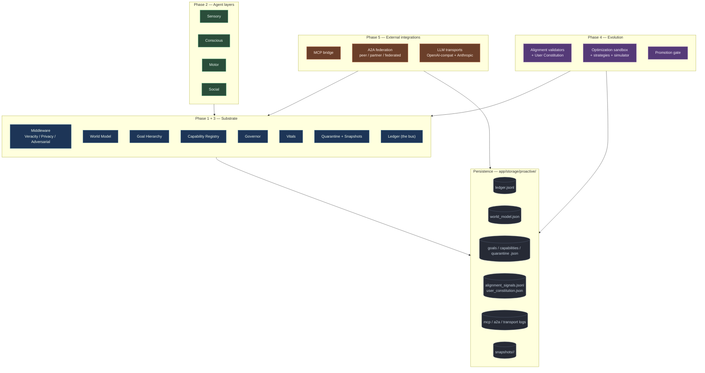
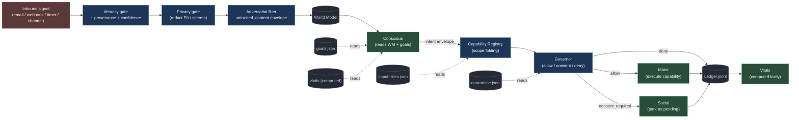
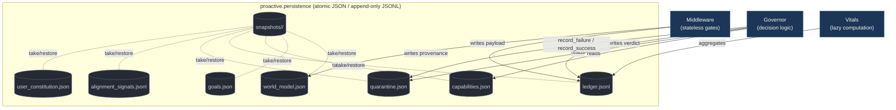
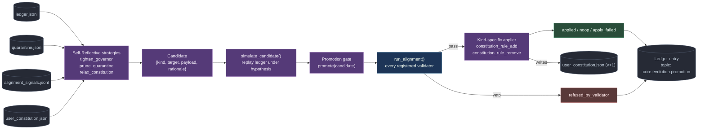
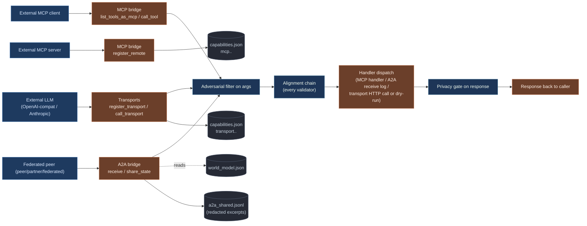
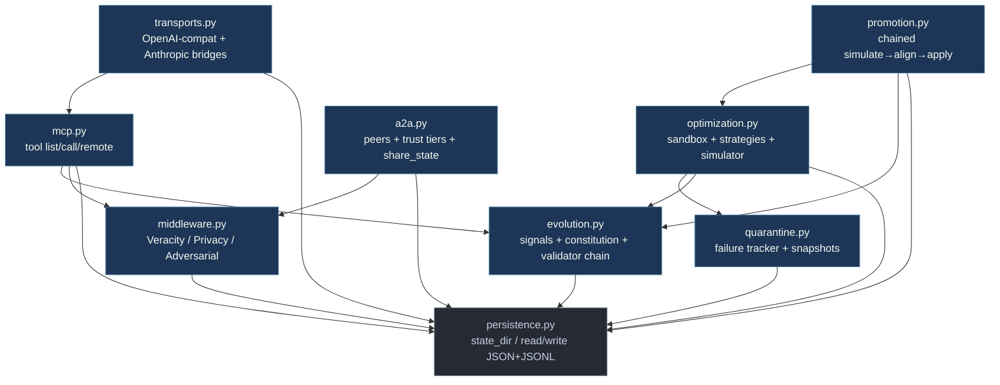
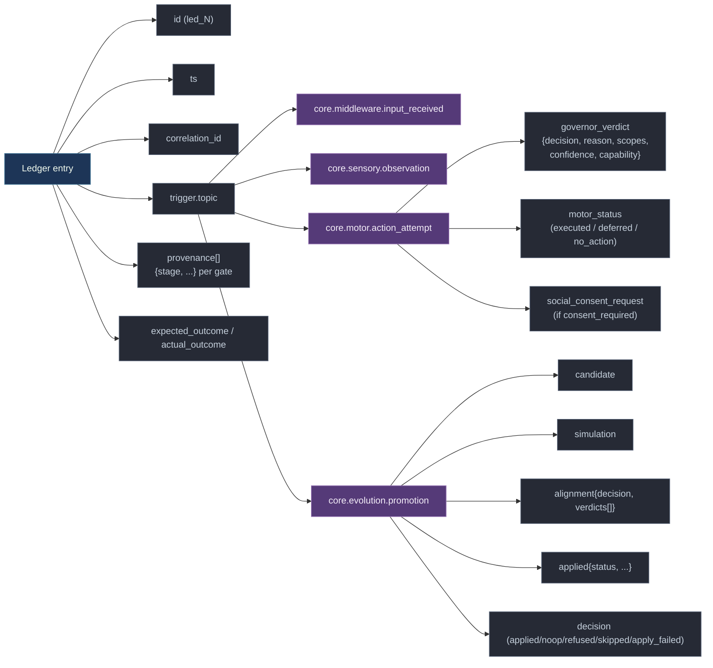

# Proactive Agent Ecology — Visual architecture

Eight Mermaid diagrams, each one capturing a different view of the system. Read in order for an end-to-end walkthrough; jump in by section if you already know the surface.

The conceptual blueprint is at `~/Desktop/proactive.md`; the engineer-facing spec is at `~/Desktop/proactive-technical.md`. This document is the picture-book companion.

---

## 1. Big picture — what's where

Everything the system contains, grouped by Phase. Boxes that touch the dotted "Storage" plate persist state on disk.

---

## 2. Signal flow — one inbound observation, end to end

Trace what happens to a single email arriving via the synthetic-inbox sensor. Solid edges = data; dashed edges = side reads from state files.

**Key invariants:**

* Inbound signals **never bypass** Middleware — Sensory writes through it.
* Conscious-emitted intents re-enter the Substrate at Capability-Registry; they're treated like any other envelope.
* Governor reads quarantine state on every decision; quarantined capabilities are denied without further checks.
* Every terminal branch (allow / consent / deny) writes to the Ledger. Vitals reads it back on demand.

---

## 3. Substrate components — read/write contract

Compact reference for "who reads what, who writes what." Each component is a JSON file or computed view.

---

## 4. Evolution loop — Phase 4 in motion

How a candidate change gets from "the system thinks something should change" to "the change actually shipped or got refused." The whole flow runs offline (sandboxed); the only side-effect on production is a Ledger entry.

**Five terminal `decision` states** every promotion lands on:

| State | Meaning |
|---|---|
| `applied` | Alignment passed, change took effect, constitution version bumped |
| `noop` | Alignment passed, but the change was already in effect (idempotent) |
| `refused_by_validator` | At least one validator vetoed; nothing applied |
| `skipped_unknown_kind` | Alignment passed but no applier is registered for `candidate.kind` |
| `apply_failed` | Applier raised or returned failure |

---

## 5. External integrations — Phase 5 surface

Three protocol bridges, all routed through the Substrate's Adversarial → Alignment → Privacy chain.

**Trust tier reading rules (A2A):**

| Tier | World Model namespaces visible |
|---|---|
| `peer` | `core.public.*` only |
| `partner` | any `core.*` |
| `federated` | any namespace |

All shared excerpts pass through Privacy gate before leaving the system.

---

## 6. Module dependency graph

Top-down view of the Python module tree under `app/proactive/`. Every module imports `persistence`; nothing else has cycles.

`persistence.py` is the only leaf. Everything stacks on top.

---

## 7. HTTP surface — endpoints under `/proactive/*`

The full API surface, grouped by milestone. All POST. All gate-routed where relevant.

```mermaid
flowchart LR
    classDef hdr   fill:#1d3557,stroke:#457b9d,color:#f1faee,font-weight:bold
    classDef ep    fill:#262a35,stroke:#586478,color:#c5d0dc

    M3["M3.3 Vitals UI"]:::hdr
    M3 --> e1["/vitals"]:::ep
    M3 --> e2["/ledger"]:::ep

    M34["M3.4 Quarantine + Snapshots"]:::hdr
    M34 --> e3["/quarantine"]:::ep
    M34 --> e4["/quarantine/release"]:::ep
    M34 --> e5["/snapshots"]:::ep
    M34 --> e6["/snapshot/take"]:::ep
    M34 --> e7["/snapshot/restore"]:::ep
    M34 --> e8["/snapshot/delete"]:::ep

    M41["M4.1 Alignment"]:::hdr
    M41 --> e9["/feedback"]:::ep
    M41 --> e10["/feedback/list"]:::ep
    M41 --> e11["/constitution"]:::ep
    M41 --> e12["/constitution/update"]:::ep
    M41 --> e13["/alignment/validators"]:::ep
    M41 --> e14["/alignment/check"]:::ep

    M42["M4.2 Optimization"]:::hdr
    M42 --> e15["/optimization/propose"]:::ep
    M42 --> e16["/optimization/simulate"]:::ep

    M43["M4.3 Promotion"]:::hdr
    M43 --> e17["/promotion/promote"]:::ep

    M51["M5.1 MCP"]:::hdr
    M51 --> e18["/mcp/tools"]:::ep
    M51 --> e19["/mcp/call"]:::ep
    M51 --> e20["/mcp/register_remote"]:::ep
    M51 --> e21["/mcp/remote_tools"]:::ep
    M51 --> e22["/mcp/drop_remote"]:::ep
    M51 --> e23["/mcp/calls"]:::ep

    M52["M5.2 A2A"]:::hdr
    M52 --> e24["/a2a/peers"]:::ep
    M52 --> e25["/a2a/peers/register"]:::ep
    M52 --> e26["/a2a/peers/drop"]:::ep
    M52 --> e27["/a2a/receive"]:::ep
    M52 --> e28["/a2a/send"]:::ep
    M52 --> e29["/a2a/share_state"]:::ep
    M52 --> e30["/a2a/inbox /outbox /shared"]:::ep

    M53["M5.3 Transports"]:::hdr
    M53 --> e31["/transports"]:::ep
    M53 --> e32["/transports/register"]:::ep
    M53 --> e33["/transports/drop"]:::ep
    M53 --> e34["/transports/call"]:::ep
    M53 --> e35["/transports/calls"]:::ep
```

---

## 8. The Why-chain — what the Ledger captures

Every entry in `ledger.jsonl` is a complete audit record. Different topics carry different field sets, but they all share the spine: `id` · `ts` · `correlation_id` · `trigger.topic` · `provenance[]`. Promotion entries additionally carry the full `simulation` + `alignment.verdicts` + `applied` chain.

Click any Ledger row in the **Vitals** sidebar to see one of these entries pretty-printed in full.

---

## Reading guide

If you want… | start at
---|---
A 30-second mental model | §1 (big picture)
"How does a webhook turn into an action?" | §2 (signal flow)
"What's persisted, who writes it?" | §3 (substrate read/write contract) + §7.1 of `proactive-technical.md`
"How does the system improve itself?" | §4 (Evolution loop)
"How do I plug an external LLM in?" | §5 (External integrations) + §3.4 of `proactive-technical.md`
"What can I extend?" | §6 (module deps) + §9 of `proactive-technical.md`
"What endpoint should I call?" | §7 (HTTP surface)
"What's in a Ledger entry?" | §8 (Why-chain) + a click on any row in Vitals
