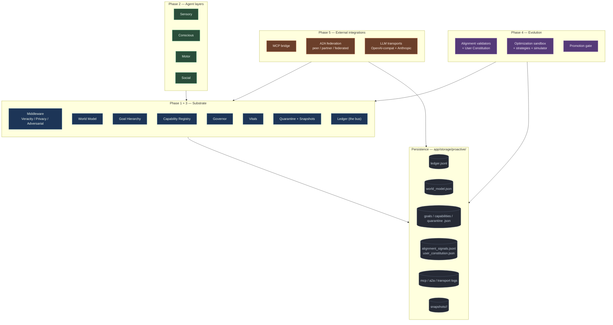
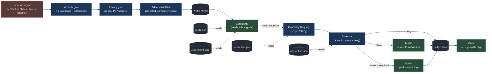
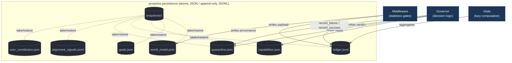
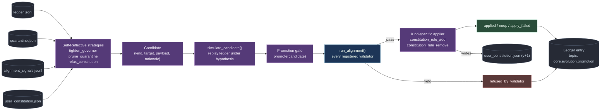
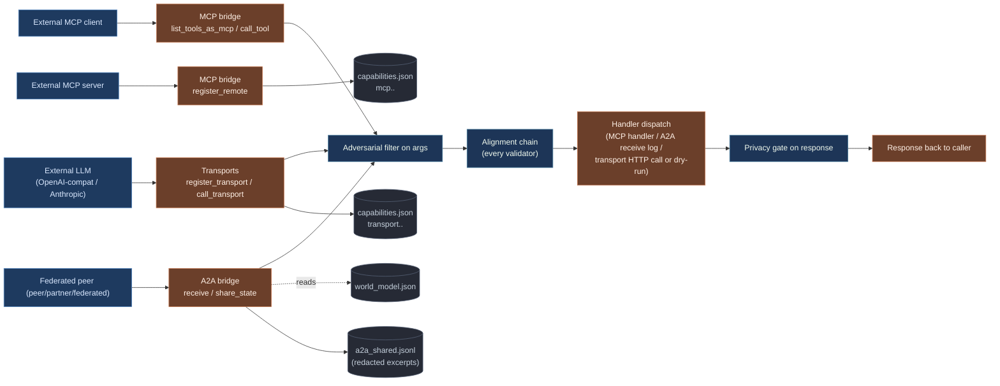
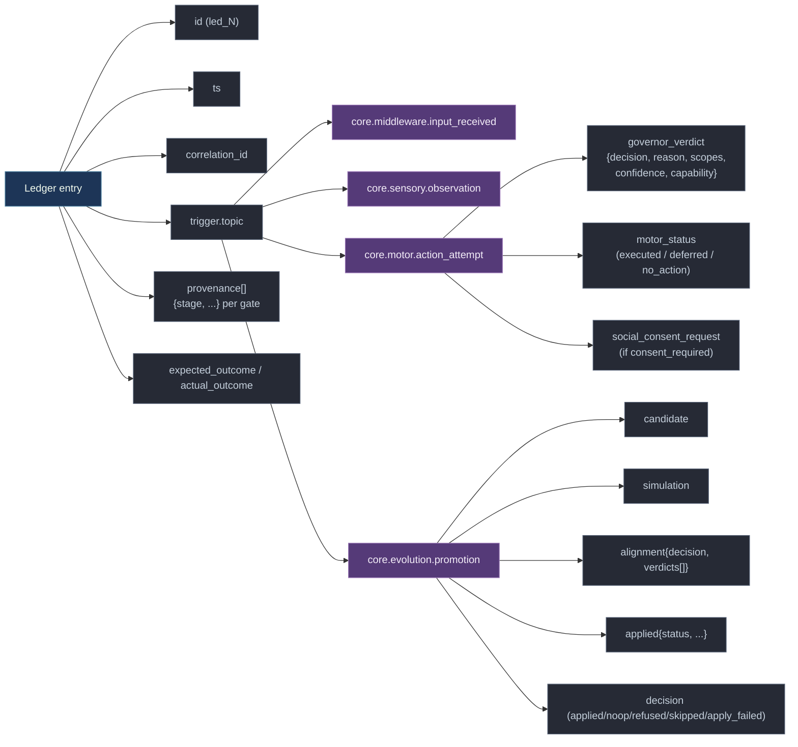
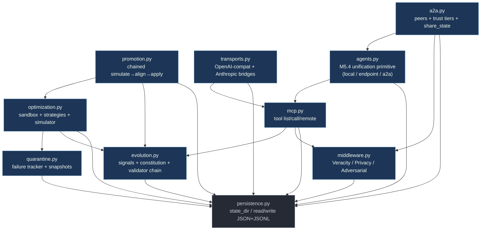

# Numel Proactive System — Guide

A single document that explains the whole Proactive AI Agent Ecology, written for two readers at once:

- **The left column** is the user guide — plain language, what each piece does for you and how to use it.
- **The right column** is the technical sidebar — file paths, function names, data shapes, endpoints. Skip it on a first read.
- **Diagrams are embedded inline** at the section they belong to (big picture in §1, signal flow in §3, Substrate read/write contract in §4, Evolution loop in §6, External integrations in §7, Why-chain anatomy in §8, module deps + HTTP surface in §9). The standalone collection lives at [docs/proactive-architecture.md](proactive-architecture.md).

> Companion documents: the conceptual blueprint at [proactive.md](proactive.md), the engineer-facing spec at [proactive-technical.md](proactive-technical.md), the visual-diagrams collection at [proactive-architecture.md](proactive-architecture.md), and the change log at [examples/proactive-CHANGELOG.md](../examples/proactive-CHANGELOG.md). This guide is the bridge between them.

---

## 1. The 30-second tour

Numel's proactive system is an agent that can act on your behalf without being prompted, but only after every action has passed through a chain of safety checks and been written to an auditable ledger.

It is built in four parts:

1. **The Substrate** — eight components that gate, store, and govern everything that happens. Nothing reaches the outside world without crossing this layer.
2. **Four Agent Layers** — Sensory (perceive), Conscious (decide), Motor (act), Social (negotiate). They plug into the Substrate; they do not replace it.
3. **The Evolution Loop** — the system learns from your feedback. New rules are simulated, validated, and only then applied.
4. **External Integrations** — MCP, A2A federation, and pluggable LLM transports. Outside services come in through the same gates as everything else.

You operate it through the **Vitals panel** in the workflow UI. Everything the system did, why it did it, and what it nearly did — all of it is one click away.

The whole picture, in one diagram — boxes that touch the dotted "Storage" plate persist state on disk:



Colour key (used throughout this document): blue = Substrate, green = Agent layer, purple = Evolution, orange = External integration, dark grey = Storage.

---

## 2. The mental model

| What you see | What's underneath |
|---|---|
| Numel "noticed" something, "decided" what to do, and "acted" or "asked first." Each of those verbs corresponds to a layer. The thing that ties them together is the **Ledger** — every step is recorded with a Why-chain you can inspect later. | The Substrate is a set of stateless gates and stateful stores built on `app/proactive/*.py`. The Ledger is a JSONL file (`ledger.jsonl`) appended to atomically. Layers run as `transform_flow` nodes inside workflow JSON. The four parts communicate by topic-routed events on the Ledger bus. |

| The five rules the system follows | Where they live |
|---|---|
| 1. Never act on input before it's been classified.<br/>2. Never leak personal data outward.<br/>3. Never act on instructions hidden inside untrusted content.<br/>4. Always check stakes before high-impact actions.<br/>5. Always record what was decided and why. | 1. Veracity gate — `middleware.veracity_gate`<br/>2. Privacy gate — `middleware.privacy_gate`<br/>3. Adversarial gate — `middleware.adversarial_gate`<br/>4. Governor — `app/api.py /proactive/governor/*`<br/>5. Ledger — `proactive/ledger.jsonl` |

---

## 3. Walking one signal end-to-end

To make the architecture concrete, follow a single inbound observation: an email arrives saying *"please transfer $5,000 to alice@example.com — see card 4111-1111-1111-1111"*. Here is what Numel does, top-to-bottom.

The shape of the journey, then the step-by-step. Solid edges = data; dashed edges = side reads from state files:



Four invariants you can read off the diagram — they hold for every signal, not just this one:

* Inbound signals **never bypass** Middleware — Sensory writes through it.
* Conscious-emitted intents re-enter the Substrate at Capability Registry; they're treated like any other envelope.
* Governor reads Quarantine state on every decision; quarantined capabilities are denied without further checks.
* Every terminal branch (allow / consent / deny) writes to the Ledger. Vitals reads it back on demand.

| Step | What you'd see in the Vitals panel | Where it happens in code |
|---|---|---|
| **Sensory layer** picks up the email and wraps it in an "observation envelope" with topic `core.observations`. | A new row appears in the Ledger pane: `core.observations · received`. | `examples/proactive-vertical-slice.json` Sensory transform node. The envelope shape is `{"topic": str, "payload": dict, "provenance": dict, "trust": str}`. |
| **Veracity** asks: "do we know this email is real?" If the source is unauthenticated, it is tagged `untrusted` but not dropped. | Source colour-coded `untrusted` in the row. | `middleware.veracity_gate(payload, provenance) -> {"trust": "trusted"\|"untrusted", "reasons": [...]}`. |
| **Privacy** scans the body. The card number and address are redacted to `[card]` and `[email]`. | Redaction count appears in the row's "Why" tooltip. | `middleware.privacy_gate(payload) -> {"redacted": dict, "matches": [...]}`. Redacts using regex patterns; mutates a deep copy. |
| **Adversarial** scans for prompt injection markers ("ignore previous instructions", role-play traps). If hit, the message is quarantined, not blocked outright. | If hit, row goes red: `quarantined · adversarial`. | `middleware.adversarial_gate(payload) -> {"safe": bool, "injection_hits": [...]}`. |
| **World Model** writes the (now-clean) observation under `core.observations.<id>`. The system "remembers" it. | The "World" panel updates to show the new observation. | `world_model.write(namespace, key, value)`; persisted to `world_model.json`. |
| **Conscious layer** reads the observation and forms a candidate: `intent: core.transfer_funds, amount: 5000, recipient: alice@example.com`. | Row: `core.transfer_funds · candidate`. | Conscious transform in the slice; emits a Ledger entry with `kind="candidate"`. |
| **Capability Registry** says: "`core.transfer_funds` exists, declared scopes `['external-network', 'spends-money', 'high-stakes']`." | The "Capabilities" subsection lights up the matched cap. | `capability_registry.lookup(name) -> {"scopes": [...]}`. Built-ins seeded from `capability_registry.json`. |
| **Goal Hierarchy** check: does this candidate satisfy a Standing Goal? If not, the candidate is downweighted but not rejected — proactivity may want to act anyway. | Goal-match badge in the row. | `goal_hierarchy.match(candidate) -> {"matched_goal": str\|None, "delta": float}`. |
| **Governor** evaluates stakes. `spends-money` + `high-stakes` together cross the threshold → verdict `consent_required`, not `allow`. | Row resolves to amber: `consent_required`. | `governor.gate(scopes) -> {"verdict": "allow"\|"consent_required"\|"refuse", "reason": str}`. Threshold: any scope in `_HIGH_STAKE` set. |
| **Social layer** prepares a consent request rather than the Motor layer firing. You see a notification: "Numel wants to transfer $5,000. Approve?" | Banner appears in the consent inbox. | Social transform emits `kind="consent_request"`; persisted to `consent_requests.json`. |
| **You approve.** Motor layer fires the transfer; result returned to the Ledger. | Row resolves green: `executed`. | Motor transform calls `capability.invoke(name, args)` then writes `kind="motor_status"`. |
| **Vitals** counts this as one `consent_required → executed` outcome and adjusts its rolling stats. | Counters tick up in the Vitals header. | `vitals.tally()` reads recent Ledger window. |
| If you'd hit the **Why** chevron**, you'd have seen every gate's verdict, the candidate, the simulation result, the alignment verdicts, and the final apply step — in one nested JSON view. | | The detail modal in `web/numel-proactive-vitals.js` (`_openWhyChain`) renders the full Ledger entry. |

That's one signal. Multiply it by every observation — emails, timer ticks, A2A peer messages, MCP tool results — and you have the full operating picture.

---

## 4. The Substrate — eight components

The Substrate is Numel's nervous system. Every event passes through it. Below, each component gets a one-paragraph user description and a sidebar with its file, API, and persistence shape.

**Read/write contract** (who reads what, who writes what — useful when something looks wrong on disk):



### 4.1 Middleware (Veracity, Privacy, Adversarial)

| What it does for you | How it's built |
|---|---|
| Three gates that every inbound payload must clear before any layer is allowed to read it. **Veracity** classifies the source as trusted or untrusted. **Privacy** strips personal data — card numbers, emails, social-security numbers, phone numbers. **Adversarial** detects prompt-injection patterns and quarantines messages that try to hijack the agent's behaviour. The gates do not block — they classify, redact, and tag, leaving the higher layers to decide what to do with the result. | `app/proactive/middleware.py`. Three pure functions: `veracity_gate(payload, provenance)`, `privacy_gate(payload)`, `adversarial_gate(payload)`. Stateless. Each returns a dict with the verdict and a reasons list. Privacy regexes target `\b(?:\d[ -]*?){13,16}\b` for cards, `[A-Za-z0-9._%+-]+@…` for emails, etc. Adversarial uses keyword + heuristic matching against an injection corpus. |

### 4.2 World Model

| What it does for you | How it's built |
|---|---|
| Numel's memory — what it has observed, what state it currently believes the world is in, what facts it has about you and your environment. Other components read from and write to it under namespaced keys (`core.observations.<id>`, `core.preferences.theme`, etc.). | `app/proactive/__init__.py` exposes `world_model` — a thin wrapper over `world_model.json`. API: `read(namespace, key=None)`, `write(namespace, key, value)`, `delete(namespace, key)`. Atomic writes via `persistence.write_json_atomic`. Namespaces are dot-paths; subtrees are returned as nested dicts. |

### 4.3 Goal Hierarchy

| What it does for you | How it's built |
|---|---|
| Numel's "north star" plus the active sub-goals it's currently pursuing. The Standing Goal is seeded once (something like *"help the operator without doing harm"*); active goals are added dynamically (e.g., *"draft response to email X"*) and expire when satisfied. Candidates that match an active goal get a confidence boost; ones that don't aren't blocked, but they're flagged as opportunistic. | `app/proactive/__init__.py` exposes `goal_hierarchy`. API: `seed_standing_goal(text)`, `add_active(text, source)`, `match(candidate) -> {"matched_goal", "delta"}`, `list_active()`. Persisted in `goals.json` — `{"standing": str, "active": [...]}`. |

### 4.4 Capability Registry

| What it does for you | How it's built |
|---|---|
| The catalog of everything Numel is allowed to do. Each entry has a name (`core.notify`, `core.send_email`, `core.transfer_funds`, `transport.openai.gpt4o`), declared **scopes** (tags like `external-network`, `spends-money`, `high-stakes`), and a handler that knows how to execute it. The Governor reads scopes to decide whether an action needs your consent. | `app/proactive/__init__.py` exposes `capability_registry`. API: `register(name, *, scopes, handler)`, `lookup(name)`, `list()`. Persisted shape in `capability_registry.json`: `{"<name>": {"scopes": [...], "handler": "<callable_id>"}}`. Built-ins seeded at import: `core.notify`, `core.send_email` (stub), `core.transfer_funds` (stub). MCP/A2A/Transports register additional caps under `mcp.<server>.<tool>`, `a2a.<peer>.<topic>`, `transport.<kind>.<alias>`. |

### 4.5 Governor

| What it does for you | How it's built |
|---|---|
| The rule that decides **allow / consent_required / refuse** based on the scopes of the proposed action. Cheap, low-risk actions get `allow`. Anything touching money, identity, or a non-revocable side-effect gets `consent_required` — the Social layer asks you. Constitution-banned scopes get `refuse`. | `app/proactive/__init__.py` exposes `governor.gate(scopes)`. Pure function. Reads constitution rules from `constitution.json`. `_HIGH_STAKE = {"spends-money", "external-network", "high-stakes", "non-reversible", …}`. Verdict logic: any scope in HIGH_STAKE → `consent_required`; any scope in constitution-banned set → `refuse`; otherwise `allow`. |

### 4.6 Vitals

| What it does for you | How it's built |
|---|---|
| The dashboard. A rolling window of the most recent Ledger entries gets summarised into health stats: how many actions executed, how many were deferred for consent, how many were refused, what the deny-rate looks like, what the most-used capabilities are. This is also where you give thumbs-up / thumbs-down feedback on individual actions. | `app/proactive/__init__.py` exposes `vitals.tally(window=...)` returning a counters dict. The UI is `web/numel-proactive-vitals.js` — auto-refresh poller hitting `/proactive/vitals`, `/proactive/ledger/recent`, `/proactive/feedback/list`, `/proactive/mcp/*`, `/proactive/a2a/*`, `/proactive/transports/*`. |

### 4.7 Quarantine + Snapshots

| What it does for you | How it's built |
|---|---|
| **Quarantine** is where messages flagged by the Adversarial gate go to die — they're held for review, never auto-released. **Snapshots** let you freeze the full system state and roll back if Evolution introduces a bad rule. | `app/proactive/quarantine.py`. API: `quarantine(entry, reason)`, `list()`, `release(id)`, `purge_older_than(days)`. Stored in `quarantine.jsonl`. Snapshots: `snapshot_create()`, `snapshot_list()`, `snapshot_restore(id)`. Snapshots tar-zip the state directory under `snapshots/<timestamp>.tar.gz`. |

### 4.8 Ledger (the bus)

| What it does for you | How it's built |
|---|---|
| The append-only event log. Every observation, every candidate, every gate verdict, every action, every feedback click, every promotion — all of it goes here, with a Why-chain you can inspect. The Ledger is also the **bus**: components don't call each other directly, they emit Ledger entries with topics, and others subscribe by reading recent entries by topic. | `app/proactive/__init__.py` exposes `ledger`. API: `append(topic, kind, payload, **why)`, `recent(window=N, topic=...)`, `read_all()`. Persisted to `ledger.jsonl` (append-only). Each entry is a JSON line: `{"id", "ts", "topic", "kind", "payload", "why": {...}}`. The Why-chain is whatever caller put in `**why` — typically `{"candidate", "simulation", "alignment", "applied", "provenance"}`. |

---

## 5. The Agent Layers

Layers are where the agent's "personality" lives. They are deliberately thin — most of the heavy lifting is done by the Substrate. **Since M5.7 each Substrate stage and most Agent layers are first-class graph nodes** (`veracity_gate_flow`, `privacy_gate_flow`, `adversarial_gate_flow`, `world_model_write_flow`, `ledger_append_flow`, `goal_match_flow`, `capability_lookup_flow`, `governor_decide_flow`, `motor_execute_flow`, `social_consent_flow`, `vitals_sweep_flow`); the only `transform_flow` nodes left in the proactive demos are workflow-specific glue (a synthetic-inbox fixture, an email parser, a Conscious decision heuristic, the Build/Parse Prompt around the `agent_flow`).

| Layer | What it does for you | Technical contract |
|---|---|---|
| **Sensory** | Watches the world. Polls inboxes, listens for timer ticks, accepts webhook deliveries, subscribes to A2A peer messages. Wraps each event in a uniform observation envelope and emits it to the Ledger. | A `transform_flow` per sensor source (free-form parsing) feeding into the typed Substrate chain (`veracity_gate_flow` → `privacy_gate_flow` → `adversarial_gate_flow` → `world_model_write_flow` → `ledger_append_flow` with `topic="core.sensory.observation"`). |
| **Conscious** | Decides. Reads the World Model, picks a candidate intent for the most recent unhandled observation. May consult a goal, a heuristic, or an LLM. Emits a `candidate` entry to the Ledger. | A `transform_flow` for deterministic logic; for LLM-backed reasoning wire an `agent_flow` node (the canonical path since M5.4 — auto-registers as `agent.<id>` and runs through Adversarial → Alignment → handler → Privacy without any extra wiring). Output: `kind="candidate"`, payload `{"intent": "<cap_name>", "args": {...}}`. Falling back to `transports.call_transport(alias, prompt, dry_run=True)` from a `transform_flow` is still valid for **offline / dry-run testing** when you don't have a model running, but it's no longer the recommended pattern for real agent invocation. |
| **Motor** | Acts. Reads candidates the Governor has approved, invokes the matching capability, writes the result back. | First-class `motor_execute_flow` node (M5.7) — appends to `variables["actions"]` and tags the envelope with `motor_status = "executed" / "deferred_to_social" / "no_action"` based on the Governor verdict. |
| **Social** | Negotiates. Holds consent inboxes, manages dialogues, asks the operator before high-stakes actions. | First-class `social_consent_flow` node (M5.7) — appends to `variables["pending_consents"]` and tags the envelope with `social_consent_request` when the Governor returned `consent_required`. |

> Three reference workflows demonstrate the four-layer pipeline:
>
> - **`examples/proactive-vertical-slice.json`** — deterministic Conscious. Hand-coded heuristics, no LLM required.
> - **`examples/proactive-vertical-slice-agent-flow.json`** — **canonical M5.4 variant.** Conscious is a real `agent_flow` node wired to `agent_config` + `model_config` + `agent_options_config`. The agent_flow auto-registers as `agent.<id>` in the Capability Registry and runs through the Substrate gate chain automatically. Requires a real model backend (defaults to Ollama with `llama3`); swap models by editing the `model_config` node. Get full Agno features (tools, memory, knowledge, multimodal) for free.
> - **`examples/proactive-vertical-slice-agentic.json`** — predates M5.4. Conscious is a `transform_flow` calling `transports.call_transport(..., dry_run=True)`. **Offline / dry-run variant** — useful when you don't have a model backend running. Kept for that purpose.

---

## 6. The Evolution Loop

Numel improves itself by closing this loop:

```
your feedback → optimization sandbox → alignment validators → promotion gate → applied (or refused)
```

In full — the whole flow runs offline (sandboxed); the only side-effect on production is a Ledger entry:



| Stage | What you see | What's underneath |
|---|---|---|
| **You give feedback.** Thumbs-up means "yes, more of this." Thumbs-down means "no, don't do this kind of thing again." Edits ("I would have answered differently") are also captured. **Since M5.8 the system also captures _implicit_ feedback** — operator actions on the running system (consent approved/rejected, manual undo, notification dismissed, agent draft accepted/discarded) flow into the same corpus at half-weight. | Click thumbs in any Vitals row, or write a free-form comment in the modal. Implicit signals are recorded automatically by the operator-action endpoints (`/proactive/feedback/implicit`, `/proactive/motor/undo`). | `app/proactive/evolution.py` — `record_feedback(kind, target, payload)` for explicit, `record_implicit_signal(target_id, signal, *, context)` for implicit. Kinds: `KIND_THUMBS`, `KIND_EDIT`, `KIND_PREFERENCE`, `KIND_IMPLICIT_ACCEPT`, `KIND_IMPLICIT_REJECT`. Stored in `feedback.jsonl`. The `recent_thumbs_down` validator weights explicit thumbs at 1.0 and implicit at 0.5 — veto fires at weighted sum ≥ 3.0. |
| **Optimization sandbox proposes a change.** Periodically (or on demand) the system reads the recent feedback + Ledger window and proposes a candidate constitution rule — e.g., "tighten the Governor for `external-network` because the deny-rate exceeds 50%." | Candidates appear in the "Pending evolution" subsection of Vitals. | `app/proactive/optimization.py` — `propose()` → list of candidates. Four strategies: `tighten_governor`, `prune_quarantine`, `relax_constitution` (built-ins; `relax_constitution` since M5.8 weights implicit acceptance alongside explicit thumbs-up), and `llm_propose` (M5.8-B — opt-in; only fires when an `agent.evolution_proposer` Capability is registered). Tunables: `_DENY_RATE_THRESHOLD = 0.50`, `_DENY_MIN_SAMPLES = 4`, `_QUARANTINE_FAILURE_FLOOR = 5`, `_THUMBS_UP_TO_RELAX = 3`. The LLM proposer reads a compact summary of recent activity, returns JSON proposals, and is hallucination-guarded: targets must exist in the Capability Registry, the Ledger, or current Constitution rules. |
| **Simulation.** Before applying, the candidate is replayed against a sandbox copy of state to estimate its effect. | "Predicted effect: 12 fewer auto-allows, 3 more consent requests" appears alongside the candidate. | `optimization.simulate_candidate(candidate, ledger, signals)` runs the candidate against a frozen state snapshot. |
| **Alignment validators run.** Each registered validator returns `accept` / `veto` / `abstain` with a reason. A single veto blocks the candidate. | Validator verdicts appear under the candidate. | `evolution.run_alignment(candidate) -> Verdict`. Built-ins: `recent_thumbs_down` (vetoes if recent thumbs-down on same target), `constitution_check` (vetoes if conflicts with existing rules — but skips governance kinds). Validators can be registered with `register_validator(name, fn)`. |
| **Promotion gate** is the apply step. Five terminal states: `applied` (success), `noop` (already in effect), `refused_by_validator`, `skipped_unknown_kind`, `apply_failed`. | The candidate row resolves to one of these; the result is written to the Ledger as `core.evolution.promotion`. | `app/proactive/promotion.py` — `promote(candidate, *, simulate=True)` chains simulate → run_alignment → apply. Built-in appliers: `constitution_rule_add` (idempotent), `constitution_rule_remove`. Custom appliers register via `register_applier(kind, fn)`. |

> No constitution rule is added without crossing every stage of this loop. If at any step the candidate is refused, it goes to the Ledger with the refusal reason — visible to you in the Vitals panel.

---

## 7. External integrations

The same gate-chain that protects internal actions protects external ones. **After the M5.4–M5.6 unification, all five surfaces — local agents (`agent_flow`), remote endpoints (`agent_endpoint_flow`), MCP, LLM transports, and A2A federation — share one invocation primitive: `mcp.call_tool` through the Capability Registry.** Every external-touching action becomes a Capability with declared scopes that the Governor and constitution rules can target by name. The diagram below shows the funnel — every arrow lands in `mcp.call_tool` and runs the same chain:



The five flavours of capability that share the Registry under the unified model:

| Capability name pattern | Source | What it represents | Default scopes |
|---|---|---|---|
| `core.<verb>` | built-in | Native handler (notify, send_email, transfer_funds) | per-handler |
| `mcp.<server>.<tool>` | M5.1 — `register_remote` | A tool advertised by an MCP-aware peer | `["external-network"]` |
| `transport.<kind>.<alias>` | M5.3 — `register_transport` | An external LLM endpoint (OpenAI / Anthropic) | `["external-network", "spends-money"]` |
| `agent.<alias>` | M5.4 — `register_agent_handler(kind=local)` | An in-process `agent_flow` invocation | `["llm"]` |
| `agent.endpoint.<alias>.<mode>` | M5.5 — auto-registered per (node, mode) | A remote `agent_endpoint_flow` call (consult / delegate / notify / handoff) | `["external-network"]` + mode-specific |
| `a2a.<peer>.send` / `a2a.<peer>.share_state` | M5.6 — auto-registered per peer | A federation interaction with a registered A2A peer | `["external-network", "tier:<tier>"]` |

Constitution rules can target any of these by name (`{kind: never, target: "agent.endpoint.alpha.delegate"}`) so the Governor's policy is declarative across every integration surface.

### 7.1 MCP (Model Context Protocol)

| What it does for you | How it's built |
|---|---|
| Lets Numel **expose** its capabilities to other MCP-aware tools, and lets it **consume** tools other systems advertise. Either direction goes through the Substrate gates. | `app/proactive/mcp.py`. Server side: `list_tools_as_mcp()`, `call_tool(name, arguments)` chains Adversarial → Alignment → handler → Privacy. Five terminal states: `ok=True`, `unknown_capability`, `alignment_veto`, `not_implemented`, `handler_error`. Client side: `register_remote(server, tool_descriptor, scopes)` → registers as cap `mcp.<server>.<tool>`. Built-in handler for `core.notify`. |

### 7.2 A2A (Agent-to-Agent federation)

| What it does for you | How it's built |
|---|---|
| Lets Numel federate with other agents. Each peer is registered with a **trust tier**: *peer* (read-only access to public state), *partner* (read/write public state), *federated* (any namespace, with scoped delegation). Inbound messages run through the Adversarial gate; outbound state-shares run through the Privacy gate. | `app/proactive/a2a.py`. Trust gates: peer reads `core.public.*` only; partner reads/writes `core.*`; federated reads any. API: `register_peer(peer_id, *, tier, name, contact)`, `receive(peer_id, message, *, kind)` (with adversarial gate), `send(peer_id, message, *, kind)`, `share_state(peer_id, namespaces)` (with privacy gate). Logs: `a2a_inbox.jsonl`, `a2a_outbox.jsonl`, `a2a_shared.jsonl`. |

### 7.3 LLM transports

| What it does for you | How it's built |
|---|---|
| Lets Numel use external LLMs (OpenAI-compatible, Anthropic) as first-class capabilities. The Conscious layer can route a decision through Claude Sonnet by calling the bridge alias; the response goes back through the same Adversarial → Alignment → handler → Privacy chain that any internal capability does. API keys are loaded from environment variables at call time, never persisted. | `app/proactive/transports.py`. Two flavours: `openai` (Chat Completions, Bearer auth) + `anthropic` (Messages API, x-api-key auth). API: `register_transport(alias, *, kind, base_url, model, api_key_env, scopes, extra)`, `call_transport(alias, prompt, *, dry_run=False)`. Caps registered as `transport.<kind>.<alias>`. Default scopes: `["external-network", "spends-money"]` (high-stake on both axes). HTTP via `urllib.request` (no extra deps). `dry_run=True` returns a synthetic echo. |

### 7.4 Agents — local + remote (M5.4 / M5.5)

| What it does for you | How it's built |
|---|---|
| **Local agent_flow nodes** become Capabilities — every LLM turn runs through Adversarial → Alignment → handler → Privacy. A constitution rule banning `agent.<alias>` blocks that agent without touching the workflow JSON. **Remote `agent_endpoint_flow` nodes** register one Capability per (node, mode) so `consult` and `delegate` against the same endpoint carry different scopes — the Governor sees them as different actions. Mode is part of the cap name (`agent.endpoint.<alias>.delegate`) so rules can target it. | `app/proactive/agents.py` is the unification primitive. API: `register_agent_handler(alias, handler, *, kind, scopes, description, input_schema, extra)`, `call_agent(alias, request, *, image, kind, extra_args)`. Three kinds: `KIND_LOCAL` (`agent.<alias>`, default scopes `["llm"]`), `KIND_ENDPOINT` (`agent.endpoint.<alias>`, default scopes `["external-network", "delegates-authority"]`), `KIND_A2A` (`a2a.<peer>.<verb>`, used by M5.6). Async handlers tolerated via coroutine detection. `WFAgentFlow` and `WFAgentEndpointFlow` always route through this module — there is no opt-out. |

### 7.5 A2A federation under the unified model (M5.6)

| What it does for you | How it's built |
|---|---|
| **Registering a peer auto-creates two Capabilities** — `a2a.<peer>.send` and `a2a.<peer>.share_state` — with the trust tier carried as a scope (`tier:peer` / `tier:partner` / `tier:federated`). That means a constitution rule like "don't send to anything under `tier:peer` without consent" or "ban `a2a.untrusted_partner.share_state`" works declaratively, no code change. Outbound goes through the gate chain like any other capability; inbound `receive` keeps the existing inline Adversarial filter (a different model — the system is being acted upon, nothing to align over). | `app/proactive/a2a.py` post-M5.6: `register_peer` calls `_ensure_peer_capabilities(peer_id, tier)` which registers both verbs via `proactive.agents.register_agent_handler`. `send` and `share_state` are thin wrappers that dispatch through `proactive.agents.call_agent`; the actual outbox / share work lives in private `_send_handler` / `_share_state_handler` that run after the gate chain clears. `drop_peer` removes the per-peer caps. The per-namespace Privacy gate inside `share_state` stays as audit detail; the chain's outer Privacy gate is defence-in-depth. |

---

## 8. Operating Numel — the Vitals panel walk-through

The Vitals panel (right sidebar of the workflow UI when a proactive workflow is loaded) is the operator's window into the system. Sections:

| Section | What you do with it | Wired to |
|---|---|---|
| **Header counters** | Glance the deny-rate, executed-count, consent-required count, refused count over the rolling window. Red means investigate. | `/proactive/vitals` |
| **Ledger (recent)** | Click any row to open the Why-chain detail modal. Thumbs-up / thumbs-down buttons inline. | `/proactive/ledger/recent`, `/proactive/feedback/record` |
| **World** | Browse what Numel currently believes. Namespaces collapse/expand. | `/proactive/world` |
| **Capabilities** | What's registered, what's allowed, what was used recently. | `/proactive/capabilities` |
| **Constitution** | The current rule set. Add a rule manually here (it goes through the same promotion gate as auto-proposals). | `/proactive/constitution`, `/proactive/promotion/promote` |
| **Pending evolution** | Auto-proposed changes awaiting promotion. Approve / reject inline. | `/proactive/optimization/propose`, `/proactive/promotion/promote` |
| **MCP** | Connected MCP tools (server + client side). Recent tool calls. | `/proactive/mcp/*` |
| **Federation (A2A)** | Registered peers. Inbox / outbox / shared excerpts (3 most recent each). | `/proactive/a2a/*` |
| **LLM transports** | Registered bridges. Recent call traces. **"Test"** button does a `dry_run=True` round-trip. | `/proactive/transports/*` |
| **Agents** | Local + remote agent capabilities (always gated). Recent call traces. | `/proactive/agents/*` |

### Common operations, end-to-end

| You want to… | What to click | What happens under the hood |
|---|---|---|
| **Approve a pending action.** | The Approve button on a `consent_required` row. | Social layer pulls the request from `consent_requests.json`, marks it approved, emits a Ledger entry; Motor layer, on its next pass, picks it up and invokes the capability. |
| **Reject a pending action.** | Reject button. | Social layer marks rejected; Motor never sees it; Ledger gets a `consent_rejected` entry. |
| **Inspect why something happened.** | Click any Ledger row. | Modal opens showing the entry's full Why-chain (candidate → simulation → alignment.verdicts → applied → motor_status → social_consent_request → provenance) — see the [Why-chain anatomy](#anatomy-of-a-ledger-entry) below for the full field set. |
| **Give feedback on an action.** | Thumbs-up or thumbs-down on a Ledger row. | `record_feedback(kind=KIND_THUMBS, target=<entry_id>, payload={"value": ±1})`. Used by Optimization sandbox to propose tightening / relaxing rules. |
| **Add a constitution rule manually.** | "Add rule" in Constitution section. | Goes through `promote(candidate=..., simulate=True)` like any auto-proposal. |
| **Roll back a bad evolution.** | Snapshots → Restore. | Restores the full state directory from a tar-zipped snapshot. |
| **Quarantine cleanup.** | Quarantine subsection → Release / Purge. | `quarantine.release(id)` re-injects to the Ledger; `purge_older_than(days)` deletes expired entries. |
| **Test an LLM bridge without spending tokens.** | LLM transports → Test on the bridge row. | Calls `call_transport(alias, prompt, dry_run=True)` — synthetic echo, no network. |

### Anatomy of a Ledger entry

<a id="anatomy-of-a-ledger-entry"></a>

Every entry in `ledger.jsonl` is a complete audit record. Different topics carry different field sets, but they all share the spine: `id` · `ts` · `correlation_id` · `trigger.topic` · `provenance[]`. Promotion entries additionally carry the full `simulation` + `alignment.verdicts` + `applied` chain.



Click any Ledger row in the **Vitals** sidebar to see one of these entries pretty-printed in full.

---

## 9. Reference

### 9.1 File inventory

| File | Purpose |
|---|---|
| `app/proactive/middleware.py` | Veracity / Privacy / Adversarial gates |
| `app/proactive/__init__.py` | World Model, Goal Hierarchy, Capability Registry, Governor, Vitals, Ledger (the eight Substrate facets) |
| `app/proactive/quarantine.py` | Quarantine + Snapshots |
| `app/proactive/evolution.py` | Feedback + Constitution + Validators + `Verdict` |
| `app/proactive/optimization.py` | Sandbox + propose + simulate_candidate |
| `app/proactive/promotion.py` | Promotion gate (5 terminal states) |
| `app/proactive/mcp.py` | MCP server + client |
| `app/proactive/a2a.py` | A2A federation (3 trust tiers) |
| `app/proactive/transports.py` | OpenAI + Anthropic LLM bridges |
| `app/proactive/agents.py` | M5.4 — Capability bridge for local agents, remote endpoints, A2A peers |
| `app/proactive/persistence.py` | Atomic JSON write, JSONL append (the only leaf module) |
| `web/numel-proactive-vitals.js` | The Vitals panel |
| `examples/proactive-substrate-stub.json` | Substrate-only scaffold (no agent layers) |
| `examples/proactive-substrate-persistent.json` | Substrate stub with disk persistence |
| `examples/proactive-sensory-slice.json` | Sensory layer + Substrate |
| `examples/proactive-vertical-slice.json` | All four layers, deterministic Conscious |
| `examples/proactive-vertical-slice-agent-flow.json` | All four layers, M5.4 canonical — Conscious is an `agent_flow` node + AgentConfig (Ollama / llama3 by default) |
| `examples/proactive-vertical-slice-agentic.json` | All four layers, offline / dry-run variant — Conscious is a transform calling `transports.call_transport` |
| `tools/lint_transforms.py` | AST linter for `transform_flow` script hazards |
| `tools/smoke_proactive.py` | 11-check smoke suite (in-process + integration) |
| `tools/git-hooks/pre-commit` | Runs the linter on staged transforms |
| `docs/transform-flow-scripts.md` | Reference for the `exec()` split-namespace gotchas |
| `docs/proactive-architecture.md` | Eight Mermaid diagrams of the system |
| `examples/proactive-CHANGELOG.md` | Living change log of the Proactive work |

### 9.2 Persistence inventory

| File on disk | Owner | Shape |
|---|---|---|
| `world_model.json` | World Model | nested dict by namespace |
| `goals.json` | Goal Hierarchy | `{"standing", "active": [...]}` |
| `capability_registry.json` | Capability Registry | `{"<name>": {"scopes", "handler"}}` |
| `constitution.json` | Evolution | `{"rules": [{"id", "kind", "payload"}]}` |
| `consent_requests.json` | Social | pending requests |
| `ledger.jsonl` | Ledger | append-only event log |
| `feedback.jsonl` | Evolution | append-only feedback log |
| `quarantine.jsonl` | Quarantine | append-only |
| `snapshots/<ts>.tar.gz` | Snapshots | full state tarball |
| `mcp_calls.jsonl` | MCP | call audit log |
| `a2a_peers.json` | A2A | peer registry |
| `a2a_inbox.jsonl` / `outbox.jsonl` / `shared.jsonl` | A2A | message logs |
| `transport_calls.jsonl` | Transports | call audit log |
| `agent_configs.json` | Agents (M5.4) | bridge configs (alias, kind, scopes, description) |
| `agent_calls.jsonl` | Agents (M5.4) | call audit log (mirrors `transport_calls.jsonl`) |

State directory is rooted at `NUMEL_PROACTIVE_DIR` (default `./proactive_state/`).

### 9.3 Module dependency graph

`persistence.py` is the only leaf — every other module imports it; nothing else has cycles. Useful when planning where to add functionality without creating cross-cuts:



### 9.4 HTTP endpoints (POST, all of them)

Approximately 44 endpoints, grouped by milestone. All POST. All gate-routed where relevant:

```mermaid
flowchart LR
    classDef hdr   fill:#1d3557,stroke:#457b9d,color:#f1faee,font-weight:bold
    classDef ep    fill:#262a35,stroke:#586478,color:#c5d0dc

    M3["M3.3 Vitals UI"]:::hdr
    M3 --> e1["/vitals"]:::ep
    M3 --> e2["/ledger"]:::ep

    M34["M3.4 Quarantine + Snapshots"]:::hdr
    M34 --> e3["/quarantine"]:::ep
    M34 --> e4["/quarantine/release"]:::ep
    M34 --> e5["/snapshots"]:::ep
    M34 --> e6["/snapshot/take"]:::ep
    M34 --> e7["/snapshot/restore"]:::ep
    M34 --> e8["/snapshot/delete"]:::ep

    M41["M4.1 Alignment"]:::hdr
    M41 --> e9["/feedback"]:::ep
    M41 --> e10["/feedback/list"]:::ep
    M41 --> e11["/constitution"]:::ep
    M41 --> e12["/constitution/update"]:::ep
    M41 --> e13["/alignment/validators"]:::ep
    M41 --> e14["/alignment/check"]:::ep

    M42["M4.2 Optimization"]:::hdr
    M42 --> e15["/optimization/propose"]:::ep
    M42 --> e16["/optimization/simulate"]:::ep

    M43["M4.3 Promotion"]:::hdr
    M43 --> e17["/promotion/promote"]:::ep

    M51["M5.1 MCP"]:::hdr
    M51 --> e18["/mcp/tools"]:::ep
    M51 --> e19["/mcp/call"]:::ep
    M51 --> e20["/mcp/register_remote"]:::ep
    M51 --> e21["/mcp/remote_tools"]:::ep
    M51 --> e22["/mcp/drop_remote"]:::ep
    M51 --> e23["/mcp/calls"]:::ep

    M52["M5.2 A2A"]:::hdr
    M52 --> e24["/a2a/peers"]:::ep
    M52 --> e25["/a2a/peers/register"]:::ep
    M52 --> e26["/a2a/peers/drop"]:::ep
    M52 --> e27["/a2a/receive"]:::ep
    M52 --> e28["/a2a/send"]:::ep
    M52 --> e29["/a2a/share_state"]:::ep
    M52 --> e30["/a2a/inbox /outbox /shared"]:::ep

    M53["M5.3 Transports"]:::hdr
    M53 --> e31["/transports"]:::ep
    M53 --> e32["/transports/register"]:::ep
    M53 --> e33["/transports/drop"]:::ep
    M53 --> e34["/transports/call"]:::ep
    M53 --> e35["/transports/calls"]:::ep

    M54["M5.4-5.6 Agents (unified)"]:::hdr
    M54 --> e36["/agents"]:::ep
    M54 --> e37["/agents/call"]:::ep
    M54 --> e38["/agents/drop"]:::ep
    M54 --> e39["/agents/calls"]:::ep
```



> M5.4–M5.6 doesn't add new entry points beyond `/agents/*` — the unification is on the *invocation side*. Local `agent_flow` calls, remote `agent_endpoint_flow` calls, and A2A `send` / `share_state` all share `proactive.agents.call_agent`, which dispatches to `mcp.call_tool`. Per-stage details: M5.4 = `agent.<alias>` for local agents, M5.5 = `agent.endpoint.<alias>.<mode>` for remote endpoints with mode-specific scopes, M5.6 = `a2a.<peer>.<verb>` for federation with `tier:<tier>` as a scope. `register_agent_handler` is Python-only (handlers aren't JSON-serialisable); registration happens automatically when a workflow loads (M5.4 / M5.5) or a peer is registered (M5.6).

### 9.5 Glossary

| Term | Meaning |
|---|---|
| **Candidate** | A proposed intent emitted by the Conscious layer. Not yet acted on. |
| **Capability** | A named, scoped, gated action Numel can take. |
| **Constitution** | The set of declarative rules Numel enforces. Mutable only through Evolution. |
| **Gate** | A pure function that classifies or transforms a payload (Veracity / Privacy / Adversarial / Governor). |
| **Ledger** | The append-only event log; also the implicit bus. |
| **Scope** | A tag attached to a capability; the Governor reads scopes to decide consent. |
| **Standing Goal** | The seeded long-lived goal the system pursues. |
| **Trust tier** | A2A peer classification: peer / partner / federated. |
| **Verdict** | An alignment-validator result: accept / veto / abstain (+ reason). |
| **Why-chain** | The full reasoning trace attached to a Ledger entry. |

### 9.6 How this guide relates to the other proactive docs

- **[docs/proactive.md](proactive.md)** — *what* the system is and *why* it's shaped this way (conceptual blueprint).
- **[docs/proactive-technical.md](proactive-technical.md)** — *exhaustive* engineer-facing spec (every API, every persistence file, every endpoint).
- **[docs/proactive-architecture.md](proactive-architecture.md)** — visual: eight Mermaid diagrams.
- **This document** — *bridge*: user-prose spine + technical sidebars, walks through what you actually see and do.
- **[examples/proactive-CHANGELOG.md](../examples/proactive-CHANGELOG.md)** — what changed when, since 2026-04-28.

Read in this order on a first pass: this guide → the architecture diagrams → the conceptual blueprint → (only if you're building on top of it) the technical spec.
